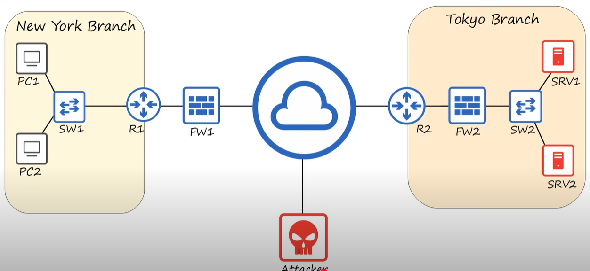
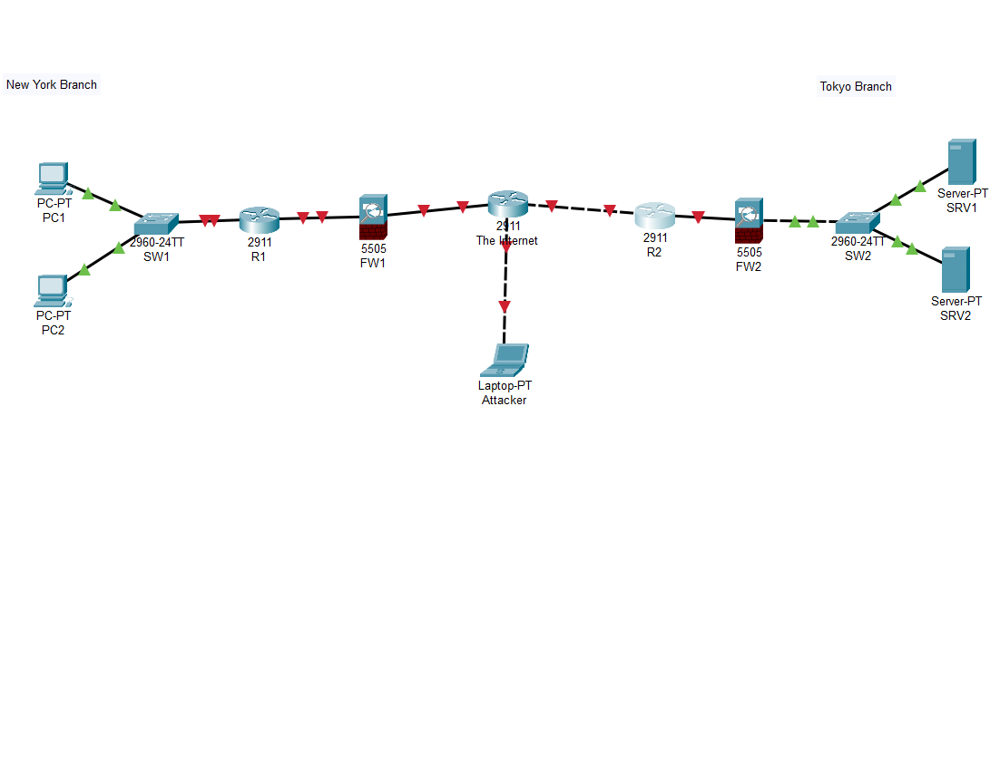

# CONTENTS

## [LAB](#lab)

### LAB

🔹 LAB INSTRUCTIONS

Objective:
Create the network diagram displayed at 16:40 of the Day 1 video.

🔹 Devices Required

Routers: Cisco 2911 (x2)

Switches: Cisco 2960 (x2)

Firewalls: Cisco ASA 5505 (x2)

PCs: (x2)

Servers: (x2)

Laptop: 1 (used as the Attacker)

🔹 Tasks

Open Packet Tracer.

Place all the above devices onto the workspace.

Connect the devices together using “Automatically Choose Connection Type”.

Replicate the network diagram shown at 16:40 in the video.

🔹 Result

[Go to the top](#contents)   