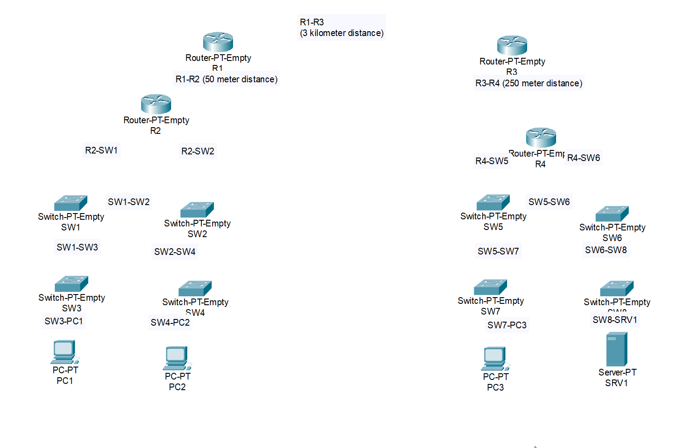
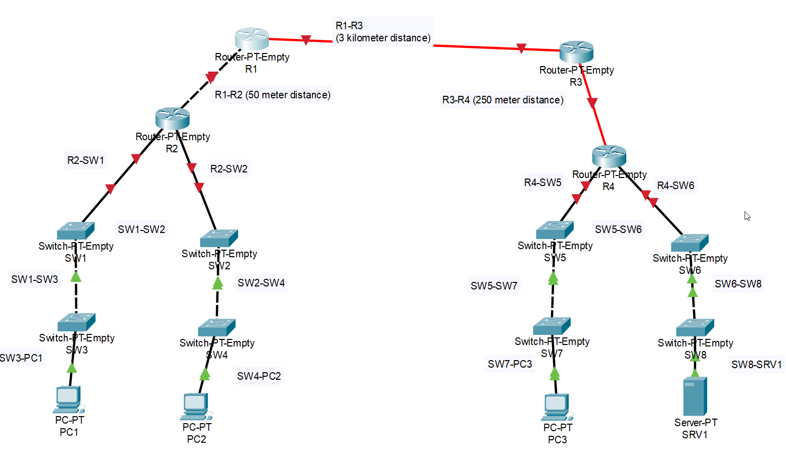

# CONTENTS

## [LAB](#lab)

### LAB

🔹 Connection Guidelines

Connect the network devices according to the labels.

Use the appropriate type of cable for each connection.

For practice, assume that Auto MDI-X is disabled or not supported on the devices.

Note: Packet Tracer does not differentiate between single-mode and multimode fiber.

In real-world scenarios:

Single-mode → long-distance links

Multimode → short-distance links

🔹 Result

🔹 Questions
    - Packet tracer didn't allow me to use "gigabit ports/copper crossover cable" between R1-R2 

[Go to the top](#contents) 