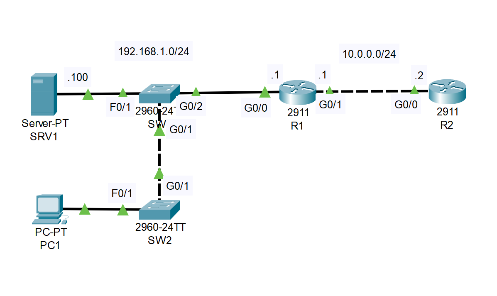
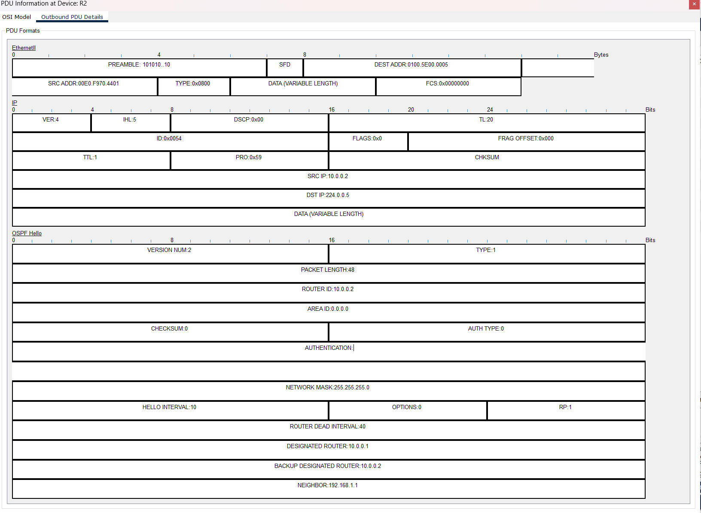
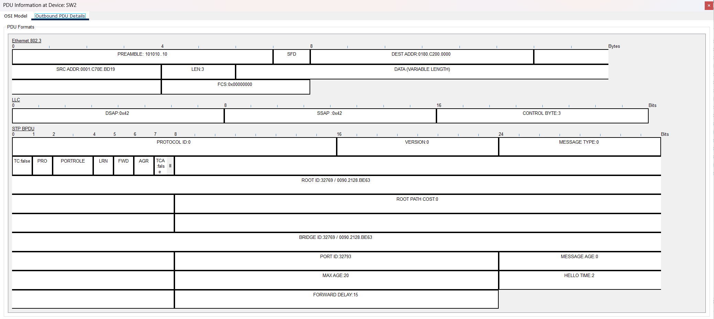
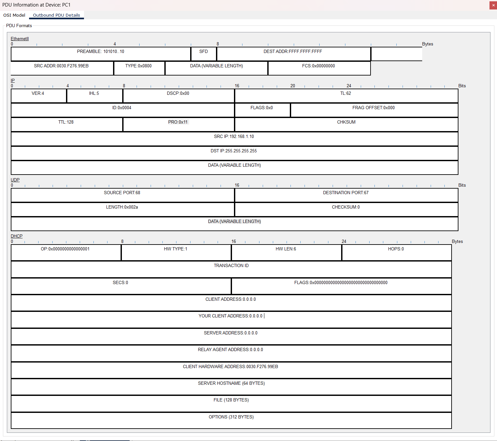
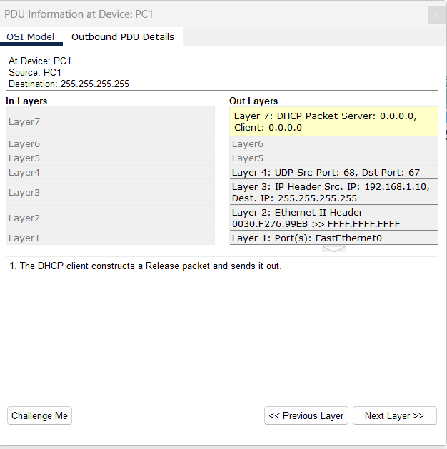

# CONTENTS

## [LAB](#lab)


### <a name="lab"></a>LAB



🔹 Lab Instructions

⚠️ Note: I recommend watching the YouTube demonstration first if you are unsure how to perform these tasks.

1️⃣ Analyze Network Traffic in Simulation Mode

Switch Packet Tracer to Simulation Mode.

Observe the various types of traffic being sent throughout the network.

Question: Which layers of the OSI model are involved in the traffic?

2️⃣ Generate Layer 7 Traffic

On PC1, release and renew the IP address.

This action will generate some Layer 7 (Application layer) traffic.

Use Simulation Mode to analyze this traffic in detail.

🔹 Result

1️⃣ 
- Layer 3 info

    - 

- Layer 2 info

    - 

2️⃣ 
```
(On any PC)
ipconfig /release
ipconfig /renew
```

- 
- 


[Go to the top](#contents) 