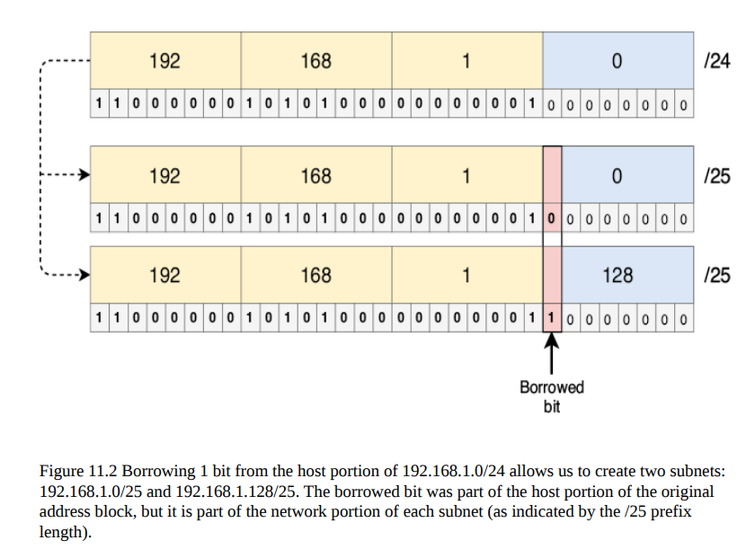
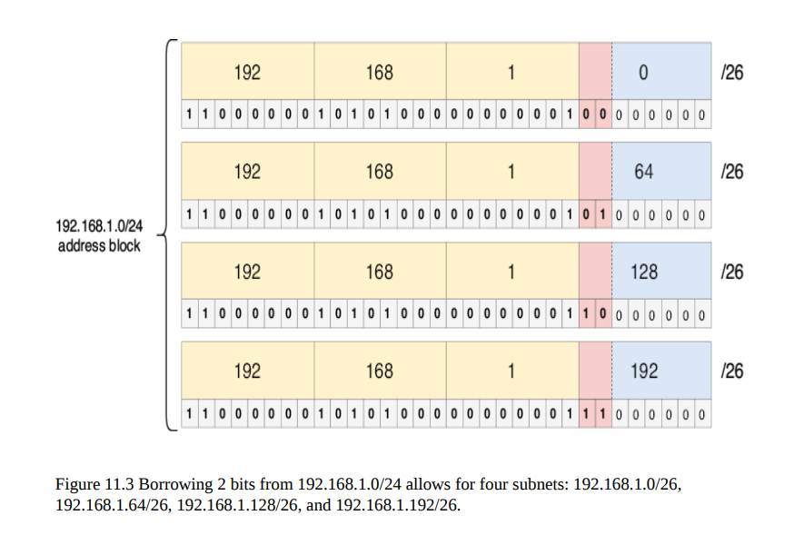
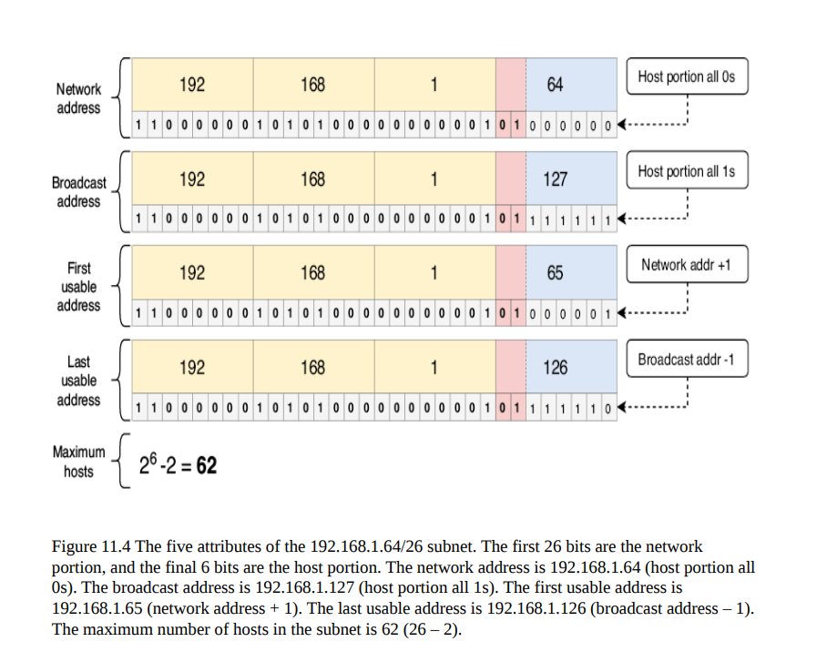
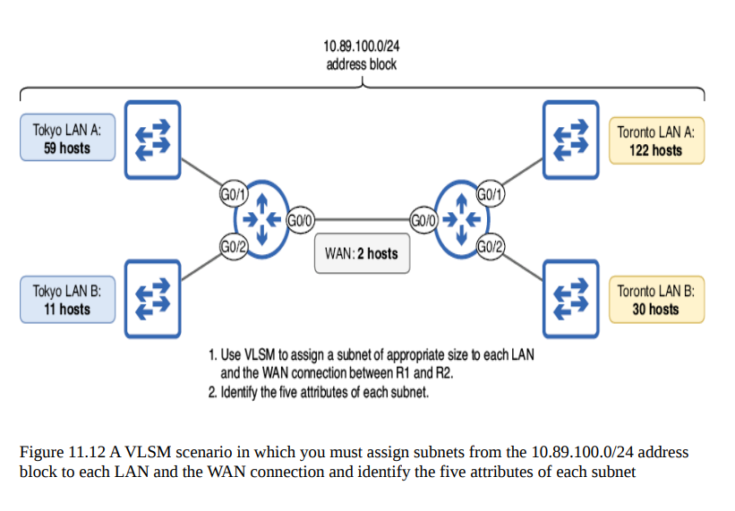
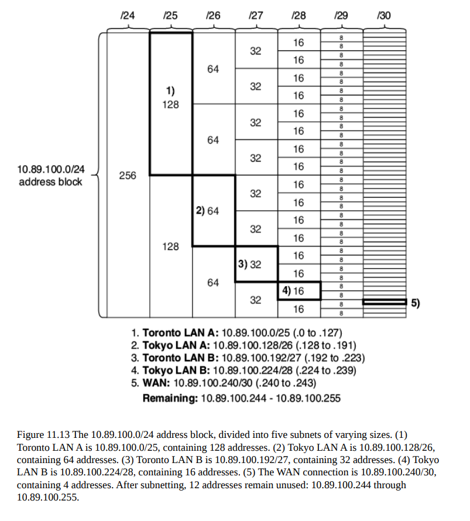
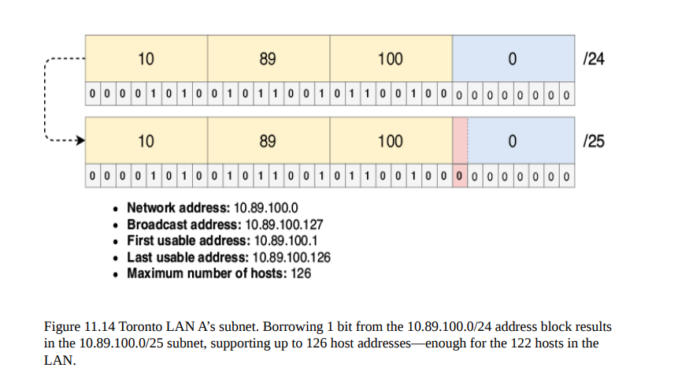
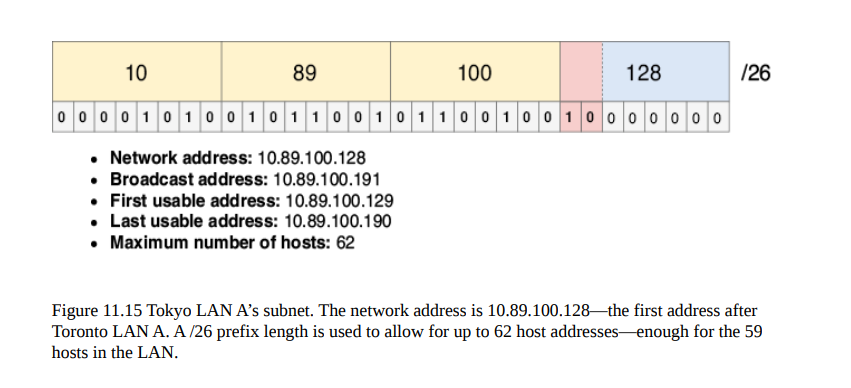
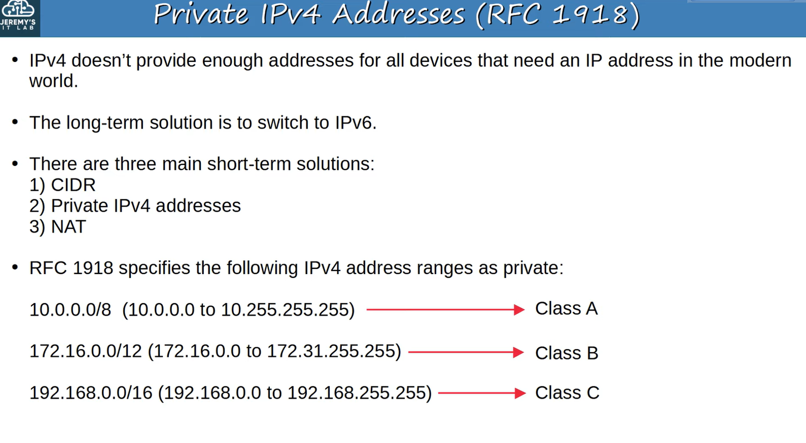
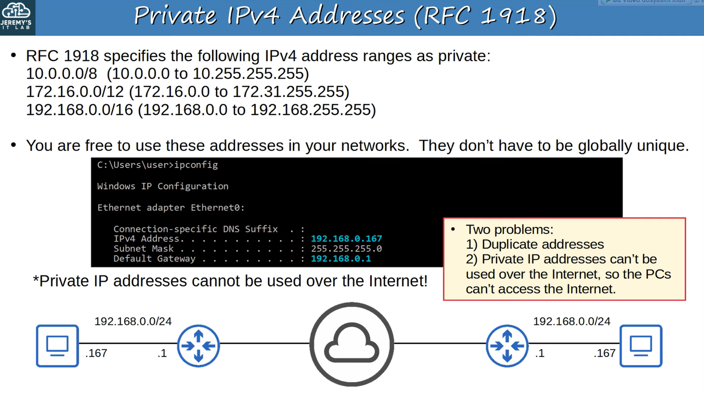

## Evolution of IPv4 Addresses Concept

1) /8 prefix length IPv4 address - network adresleri yetmiyor

2) Classfull IPv4 Addresses /8 /16 /24 - kullanılmayan host adresleri boşa gidiyor

    | Class | First Octet Range | First Octet in Binary | Default Subnet Mask | Network Bits | Host Bits | Notes                     |
    | ----- | ----------------- | --------------------- | ------------------- | ------------ | --------- | ------------------------- |
    | A     | 1 – 126           | `0xxxxxxx`            | 255.0.0.0 (/8)      | 8            | 24        | 127 reserved for loopback |
    | B     | 128 – 191         | `10xxxxxx`            | 255.255.0.0 (/16)   | 16           | 16        | Normal usage              |
    | C     | 192 – 223         | `110xxxxx`            | 255.255.255.0 (/24) | 24           | 8         | Normal usage              |
    | D     | 224 – 239         | `1110xxxx`            | N/A (Multicast)     | N/A          | N/A       | Multicast addresses       |
    | E     | 240 – 255         | `1111xxxx`            | N/A (Reserved)      | N/A          | N/A       | Experimental / Reserved   |

3) 1993, Subnetting an address block into subnets, CIDR /23 /26 /28 ...
    - FLSM
        - 
        - 
        - 
    - VLSM
        - 
        - 
        - 
        - 

4) Private IPv4 Addresses: Sadece LAN içinde problemleri çözer. İnternete bağlanamazsın bu adreslerle.
    - 
    - 

5) NAT: No preserving Global IP address
    - Static Nat 
    - Dynamic Nat 

6) ***NAT Overload / PAT (Port Address Translation): Preserving Global IP addresses.***