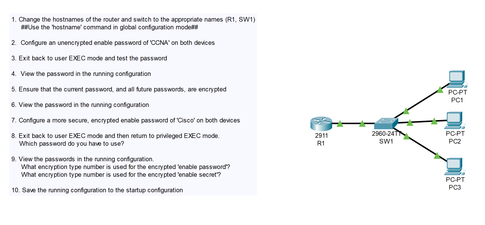
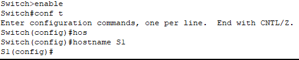
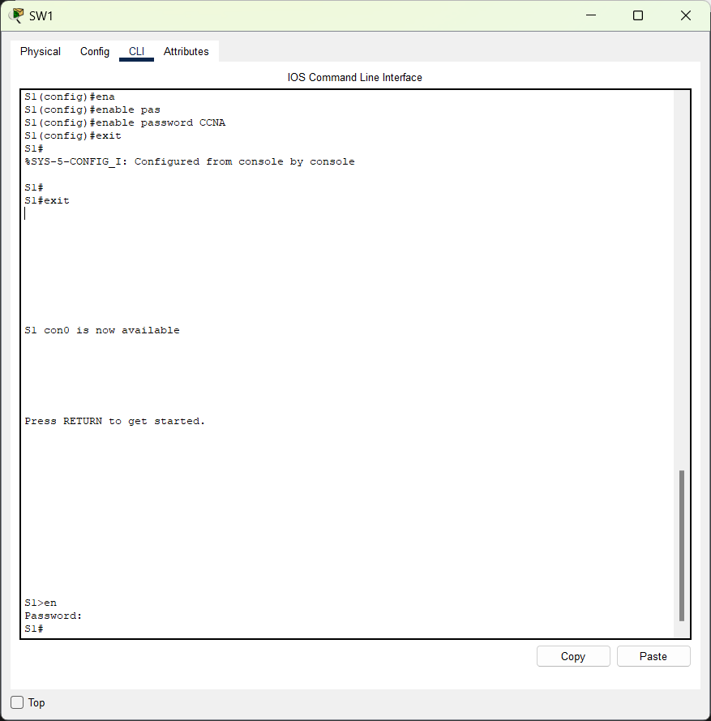
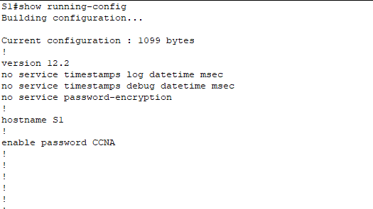
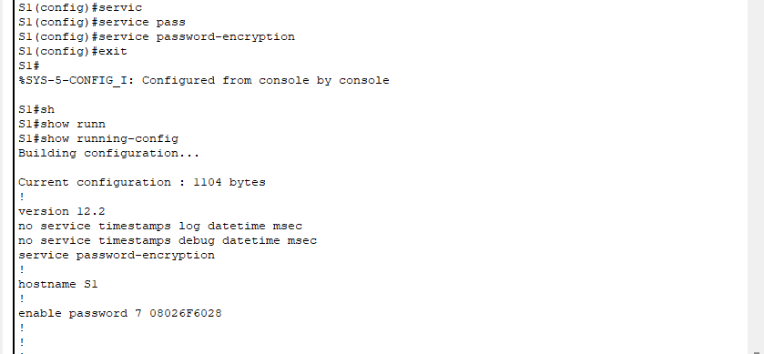
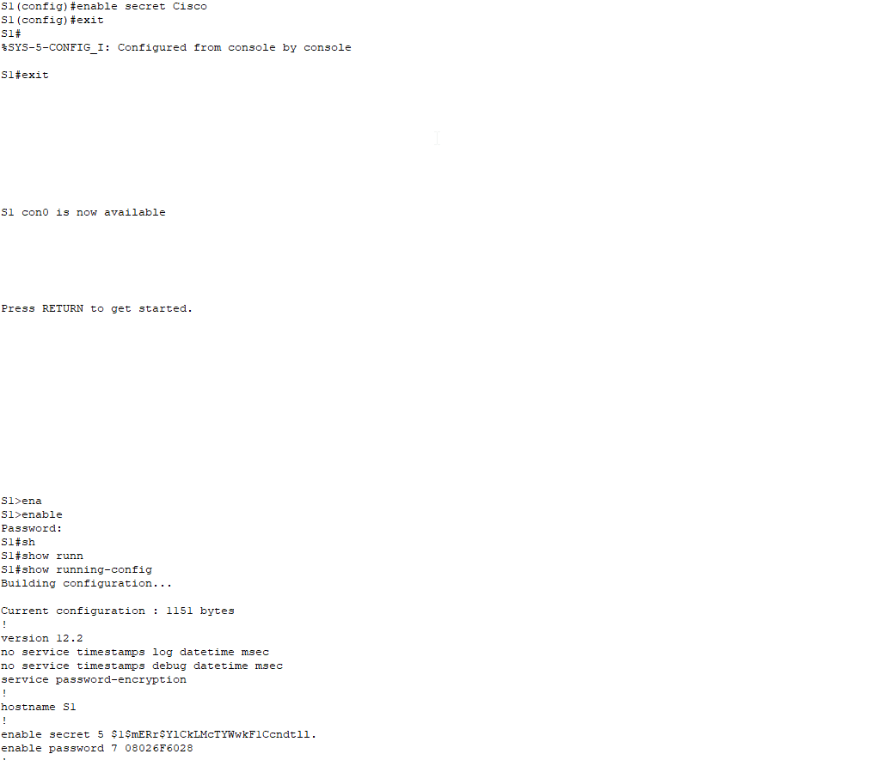

# CONTENTS

## [LAB](#lab)
### [Q1](#q1), [Q2](#q2), [Q3](#q3), [Q4](#q4), [Q5-6](#q5-6), [Q7-8-9](#q7-8-9), [Q10](#q10)

### <a name="lab"></a>LAB



### <a name="q1"></a>Q1


### <a name="q2"></a>Q2
```
S1(config)#enable password CCNA
```

### <a name="q3"></a>Q3


### <a name="q4"></a>Q4


### <a name="q5-6"></a>Q5-6


### <a name="q7-8-9"></a>Q7-8-9


### <a name="q10"></a>Q10
```
S1#write memory
```

[Go to the top](#contents) 