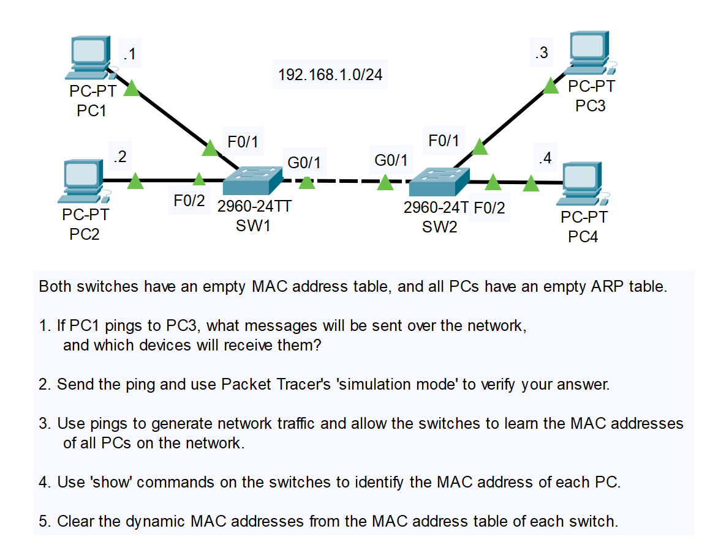
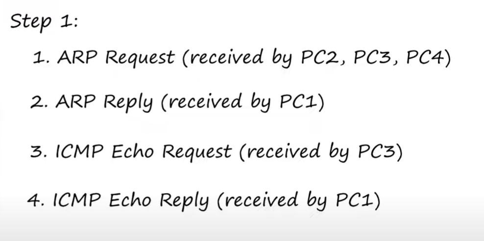
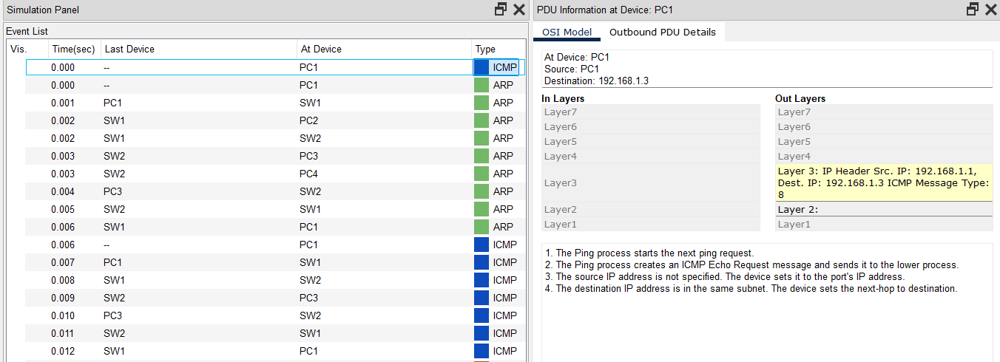
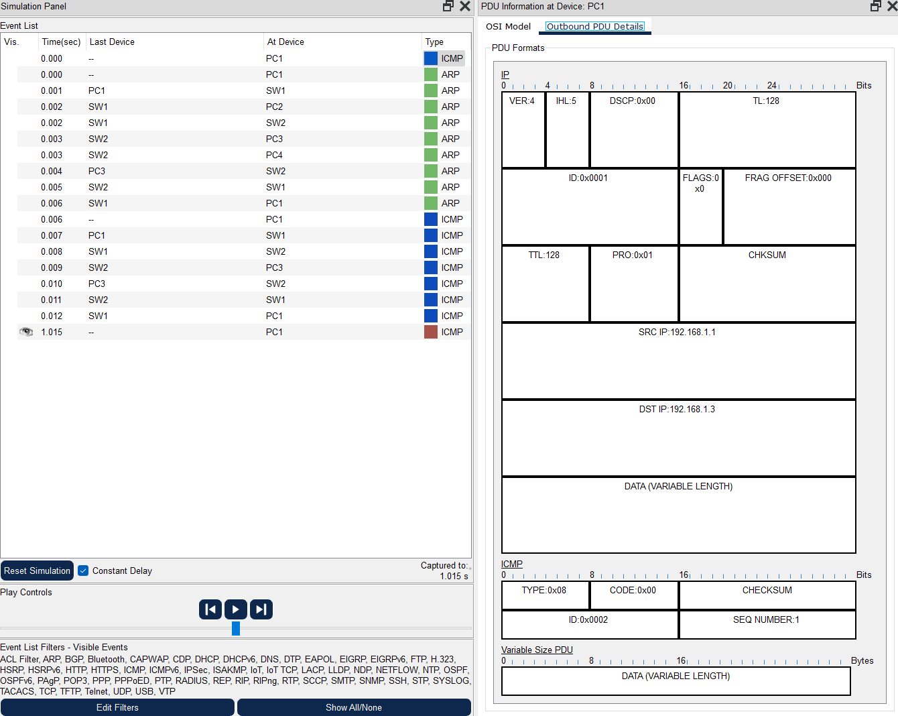
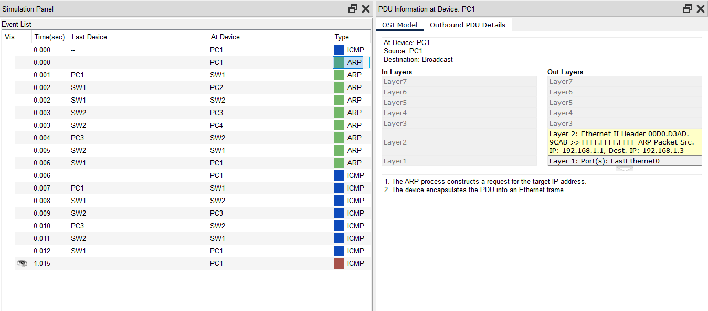
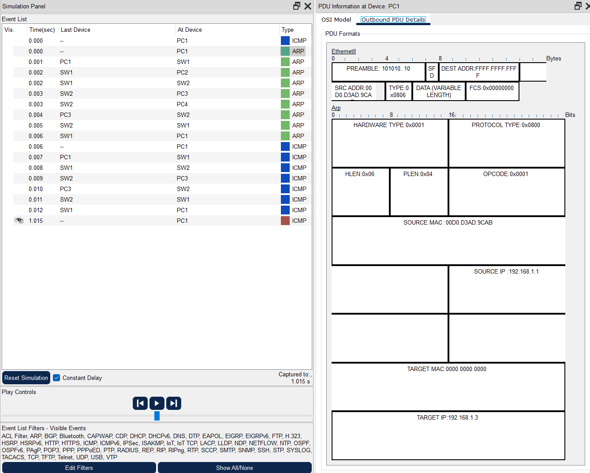
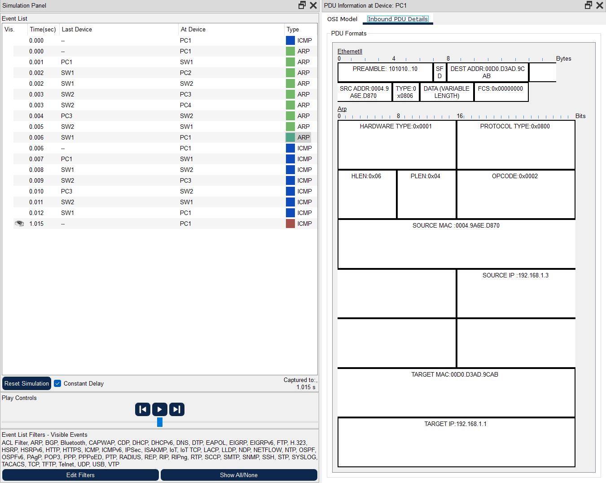
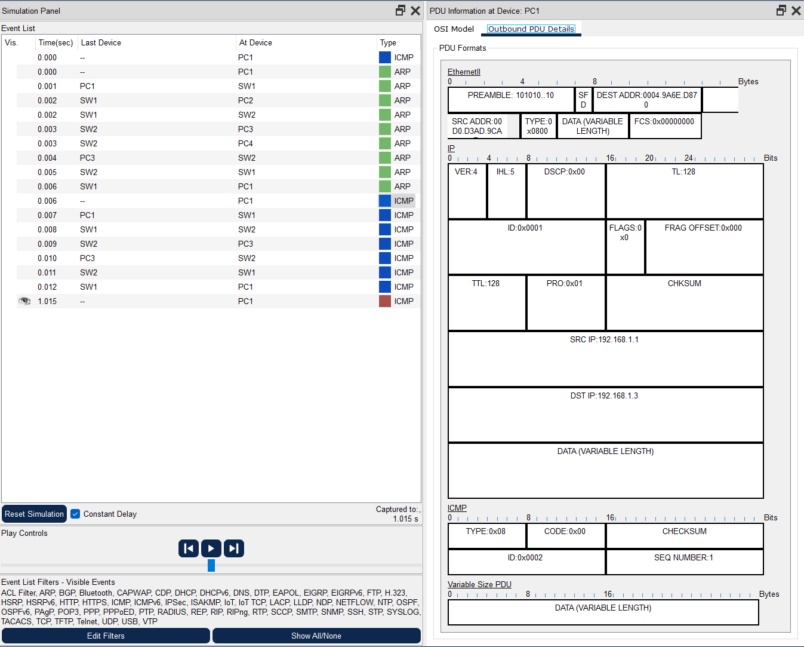

# CONTENTS

## [LAB](#lab)
### [Q1](#q1), [Q2](#q2), [Q3](#q3), [Q4](#q4), [Q5](#q5)

### <a name="lab"></a>LAB



### <a name="q1"></a>Q1


### <a name="q2"></a>Q2

---

---

---

---

---


### <a name="q3"></a>Q3
> ping PC1 to PC3

> ping PC2 to PC4

### <a name="q4"></a>Q4
```
SW1>show mac address-table
SW2>show mac address-table
```

### <a name="q5"></a>Q5
```
SW1#clear mac address-table
SW2#clear mac address-table
```

[Go to the top](#contents) 