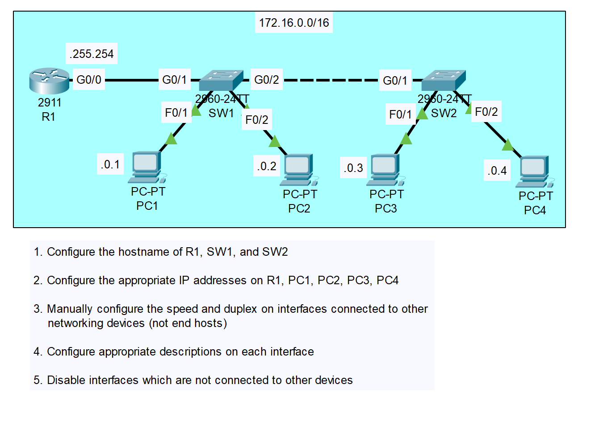
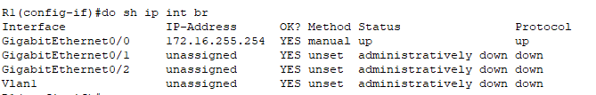
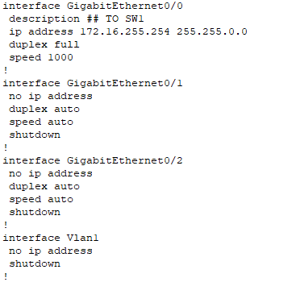
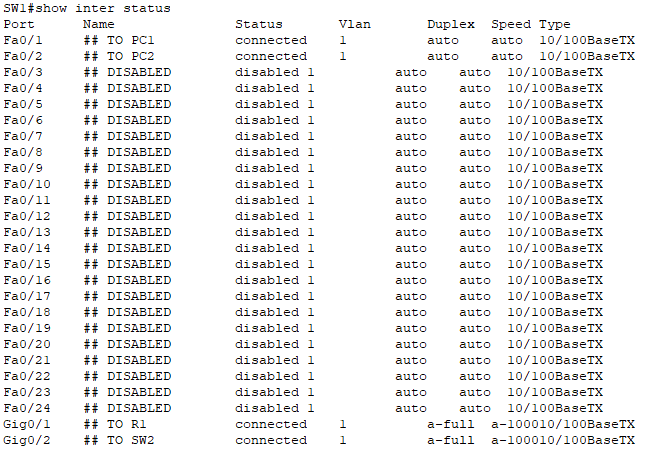
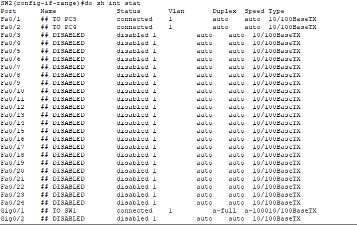
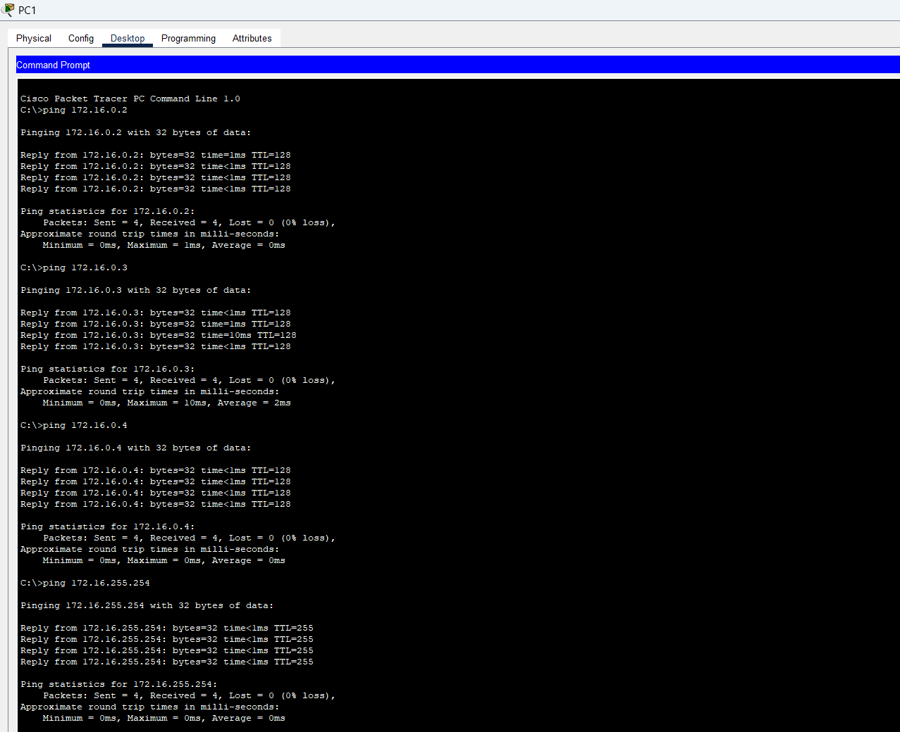

# CONTENTS

## [LAB](#lab)
### [Q1-2-3-4-5](#q1-2-3-4-5)
### [RESULT](#result)

### <a name="lab"></a>LAB



### <a name="q1-2-3-4-5"></a>Q1-2-3-4-5

```
Router(config)#hostname R1
R1(config-if)#description ## TO SW1
R1(config-if)#ip address 172.16.255.254 255.255.0.0
R1(config-if)#speed 1000
R1(config-if)#duplex full
R1(config-if)#no shutdown 

.
.
.
SW1...

.
.
.
SW2(config-if)#inter ran f0/3-24,g0/2
SW2(config-if-range)#desc
SW2(config-if-range)#description ## DISABLED
SW2(config-if-range)#shu
SW2(config-if-range)#shutdown 
```
### <a name="result"></a>RESULT



#### Running config R1:



#### Switch interfaces status

```
### Switch specific command
SW1#show interface status
SW2#show interface status
```



---




[Go to the top](#contents)