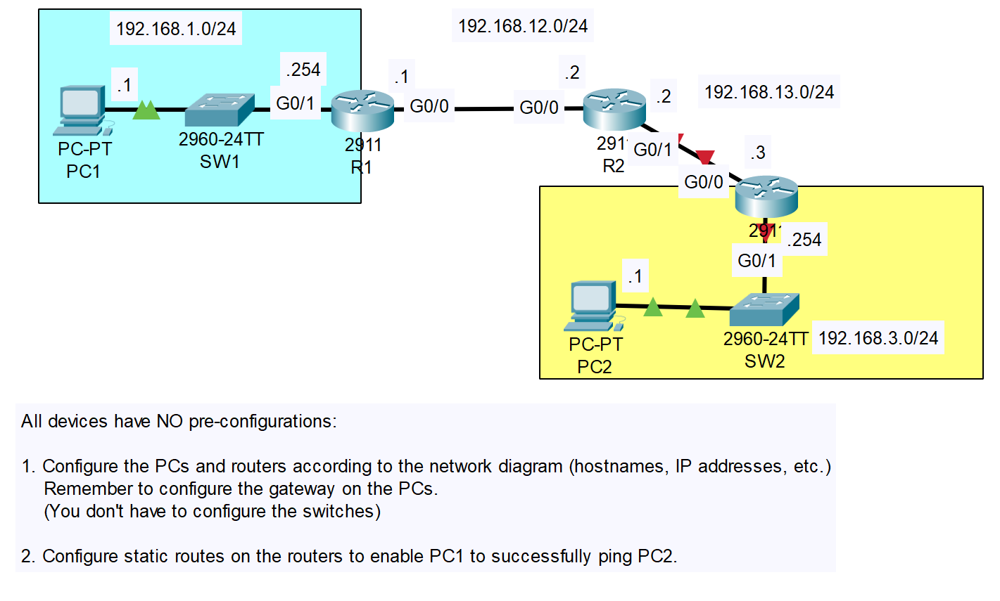
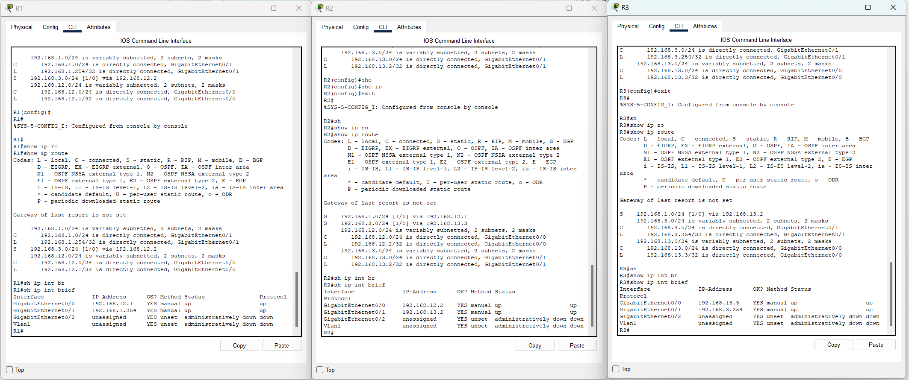
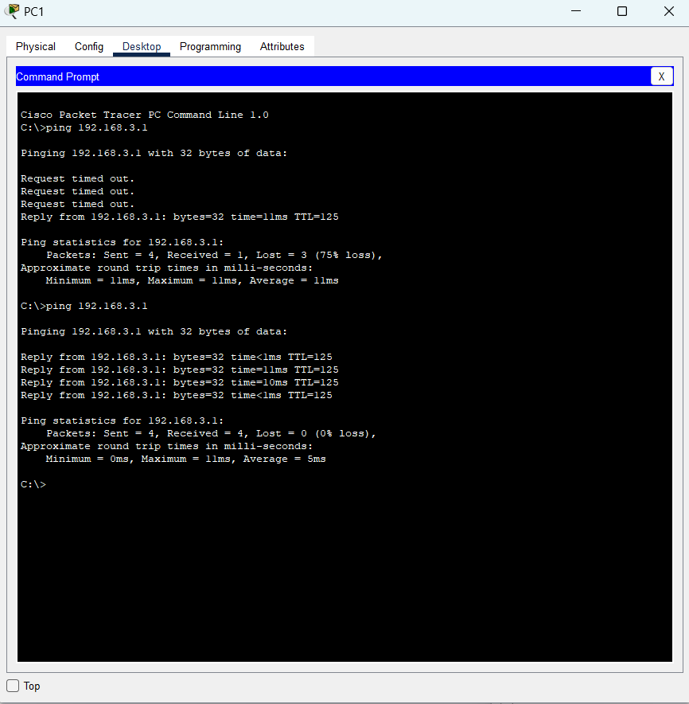

# CONTENTS

## [LAB](#lab)
### [Q1-2](#q1-2)

### <a name="lab"></a>LAB



### <a name="q1-2"></a>Q1-2

#### Başlıca Komutlar
```
.
.
.
R1(config-if)#ip address 192.168.1.254 255.255.255.0
R1(config-if)#no shutdown
R1(config)#ip route 192.168.3.0 255.255.255.0 192.168.12.2
.
.
.
```
- Girilen static route sayıları
    - R1: 1 tane (192.168.3.0/24)
    - R2: 2 tane (192.168.1.0/24 ve 192.168.3.0/24)
    - R3: 1 tane (192.168.1.0/24)



---

- Ping Test:



[Go to the top](#contents)