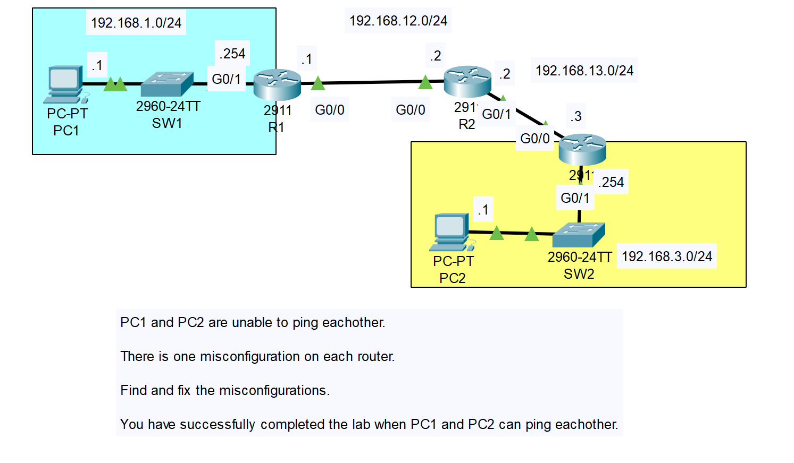
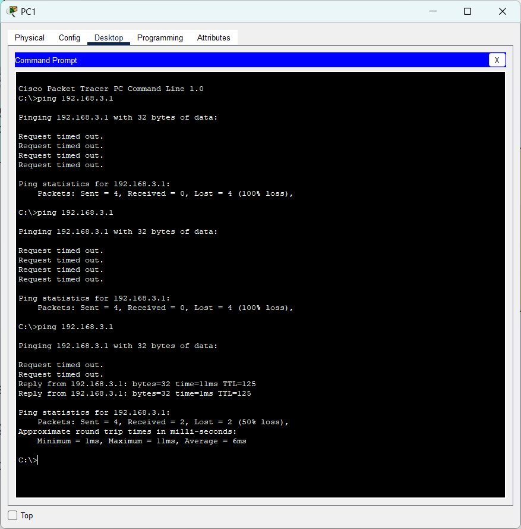

# CONTENTS

## [LAB](#lab)
### [Q1](#q1)

### LAB

### Q1

#### ÇÖZÜM
- R1'de hatalı static route yapılandırması(192.168.3.0/24 ağı için hatalı NEXT_HOP girildi)
- R2'de hatalı static route yapılandırması(192.168.3.0/24 ağı için hatalı interface girildi)
- R3'de g0/0 arayüzünde hatalı ip address yapılandırması ve 192.168.1.0/24 ağı için static route eklenmemesi

#### RESULT

