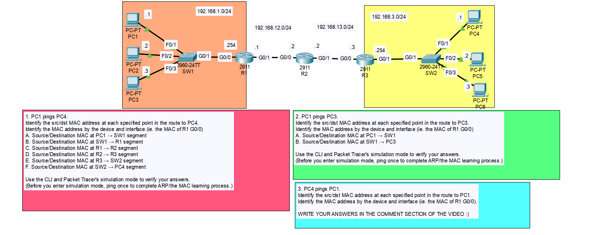

# CONTENTS

## [LAB](#lab)
### [Q1](#q1), [Commands](#commands)

### <a name="lab"></a>LAB



### <a name="q1"></a>Q1

> A: PC1 -> SW1
    >> 00D0.BA11.1111(PC1 MAC) -> 0000.01AA.AAAA(R1 G0/0 Interface)

> B: SW1 -> R1
    >> 00D0.BA11.1111(PC1 MAC) -> 0000.01AA.AAAA(R1 G0/0 Interface)

> C: R1 -> R2
    >> 0000.01BB.BBBB(R1 G0/1 Interface) -> 0000.01CC.CCCC(R2 G0/0 Interface)

> D: R2 -> R3
    >> 0000.01DD.DDDD(R2 G0/1 Interface) -> 0000.01EE.EEEE(R3 G0/0 Interface)

> E: R3 -> SW2
    >> 0000.01FF.FFFF(R3 G0/1 Interface) -> 000C.8544.4444(PC4 MAC)

> F: SW2 -> PC4
    >> 0000.01FF.FFFF(R3 G0/1 Interface) -> 000C.8544.4444(PC4 MAC)

### <a name="commands"></a>Commands

```
## Learning pc's mac
C:\>ipconfig /all 
```

```
## Learning router's mac

## First way
R1#show interfaces g0/1

## Second way
R1#show running-config
```
