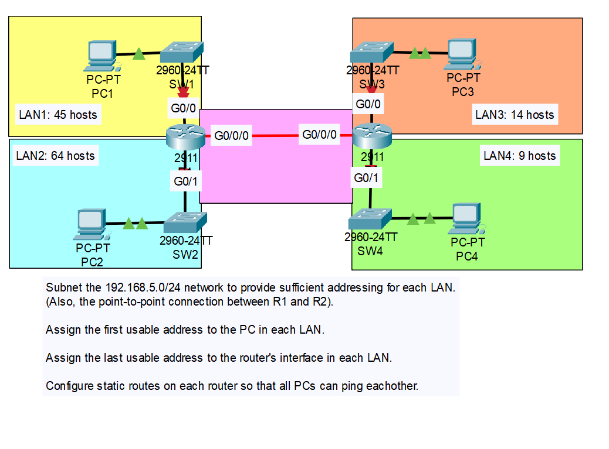
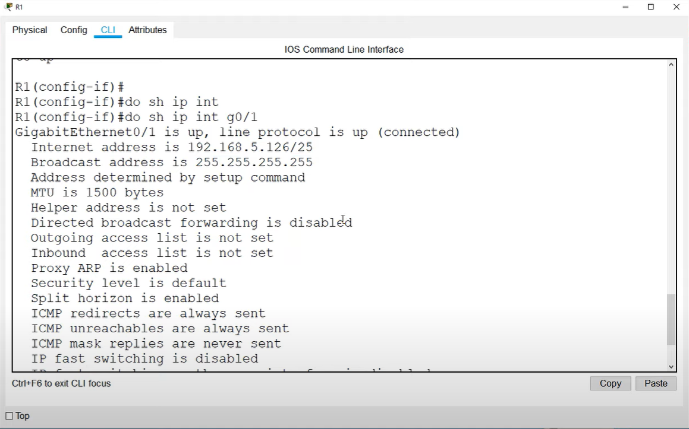

# CONTENTS

## [LAB](#lab)
### [Q1](#q1), [Commands](#commands), [Notes](#notes)

### <a name="lab"></a>LAB



### <a name="q1"></a>Q1
- Her bir ağ, hosts+2(broadcast+network) kadar adrese ihtiyaç duyar.

    - LAN2: 2 + 64 = 66(7 HOST bit-128)
    - LAN1: 2 + 45 = 47(6 HOST bit-64)
    - LAN3: 14 + 2 = 16(4 HOST bit-16)
    - LAN4: 9 + 2 = 11(4 HOST bit-16)
    - ROUTER'LAR ARASI LAN: 2 + 2 = 4(2 HOST bit-4)

LAST OCTET of 192.168.5.0

- LAN2:
    - SUBNET MASK: 255.255.255.128
    - 00000000: Network Address(192.168.5.0)
    - 00000001: PC2 Address(192.168.5.1)
    - 01111110: R1 G0/1 Address(192.168.5.126)
    - 01111111: Broadcast Address(192.168.5.127)

- LAN1:
    - SUBNET MASK: 255.255.255.192
    - 10000000: Network Address(192.168.5.128)
    - 10000001: PC1 Address(192.168.5.129)
    - 10111110: R1 G0/0 Address(192.168.5.190)
    - 10111111: Broadcast Address(192.168.5.191)

- LAN3:
    - SUBNET MASK: 255.255.255.240
    - 11000000: Network Address(192.168.5.192)
    - 11000001: PC3 Address(192.168.5.193)
    - 11001110: R2 G0/0 Address(192.168.5.206)
    - 11001111: Broadcast Address(192.168.5.207)

- LAN4:
    - SUBNET MASK: 255.255.255.240
    - 11010000: Network Address(192.168.5.208)
    - 11010001: PC4 Address(192.168.5.209)
    - 11011110: R2 G0/1 Address(192.168.5.222)
    - 11011111: Broadcast Address(192.168.5.223)  

- ROUTER'LAR ARASI LAN:  
    - SUBNET MASK: 255.255.255.252
    - 11100000: Network Address(192.168.5.224)
    - 11100001: R1 G0/0/0 Address(192.168.5.225)
    - 11100010: R2 G0/0/0 Address(192.168.5.226)
    - 11100011: Broadcast Address(192.168.5.227)  


### <a name="commands"></a>Commands

```
## shows various info for an interface

R1#show ip int g0/1
```



### <a name="notes"></a>Notes
- Limited broadcast vs Directed broadcast
    - 255.255.255.255: Local usage
    - 192.168.5.223(broadcast of LAN 4) can be reached by other LANs.