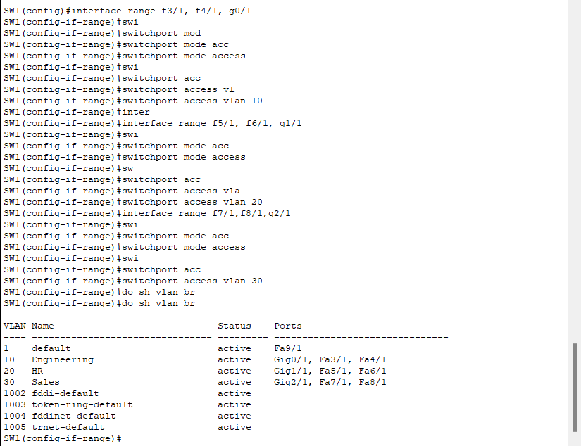

# CONTENTS

## [LAB](#lab)
### [Q1](#q1), [Q2](#q2), [Q3](#q3), [Q4](#q4), [Commands](#commands), [Notes](#notes)

### <a name="lab"></a>LAB


### <a name="q1"></a>Q1

- VLAN10: Engineering
    - Network Address: 10.0.0.0 
    - Prefix Length: 26
    - Last Octet of network address: 00000000 
    - Subnet Mask: 255.255.255.192
    - Last Octet of subnet mask: 11000000
    - ***PC1: 10.0.0.1***
    - ***PC2: 10.0.0.2***
    - Broadcast Address's Last Octet: 00111111
    - Broadcast Address: 10.0.0.63
    - ***Default Gateway: 10.0.0.62***

- VLAN20: HR
    - Network Address: 10.0.0.64
    - Prefix Length: 26
    - Last Octet of network address: 01000000 
    - Subnet Mask: 255.255.255.192
    - Last Octet of subnet mask: 11000000
    - ***PC3: 10.0.0.65***
    - ***PC4: 10.0.0.66***
    - Broadcast Address's Last Octet: 01111111
    - Broadcast Address: 10.0.0.127
    - ***Default Gateway: 10.0.0.126***

- VLAN30: SALES
    - Network Address: 10.0.0.128
    - Prefix Length: 26
    - Last Octet of network address: 10000000 
    - Subnet Mask: 255.255.255.192
    - Last Octet of subnet mask: 11000000
    - ***PC5: 10.0.0.129***
    - ***PC6: 10.0.0.130***
    - Broadcast Address's Last Octet: 10111111
    - Broadcast Address: 10.0.0.191
    - ***Default Gateway: 10.0.0.190***

### <a name="q2"></a>Q2


### <a name="q3"></a>Q3




### <a name="q4"></a>Q4


### <a name="commands"></a>Commands

```
SW1#sh vlan brief
```

### <a name="notes"></a>Notes