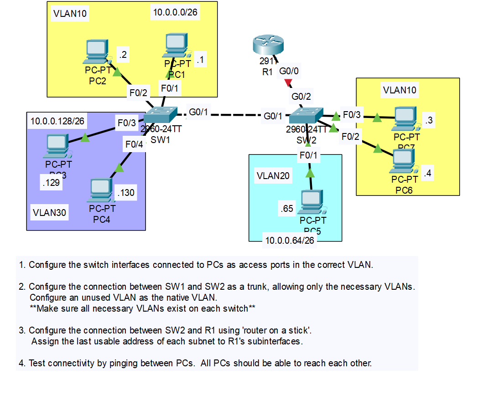
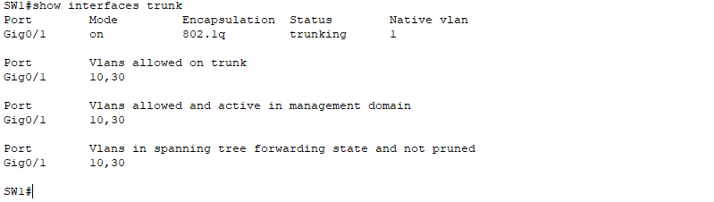
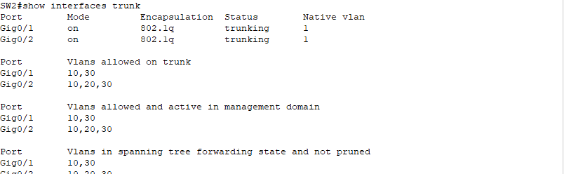
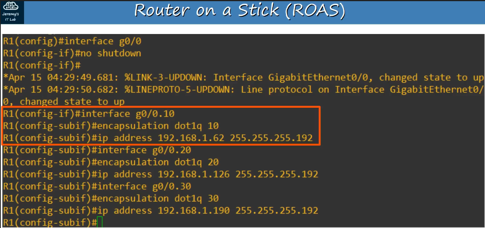
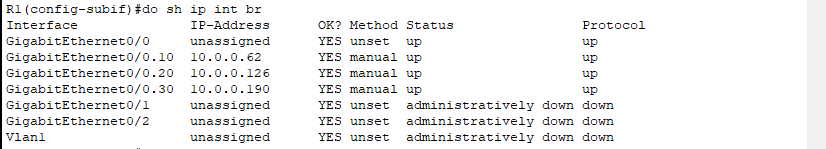

# CONTENTS

## [LAB](#lab)
### [Q1](#q1), [Q2](#q2), [Q3](#q3), [Commands](#commands), [Notes](#notes)

### <a name="lab"></a>LAB



### <a name="q1"></a>Q1

```
SW1(config)#interface range f0/1-2
SW1(config-if-range)#switchport mode access 
SW1(config-if-range)#switchport access vlan 10
SW1(config-if-range)#inter range f0/3-4
SW1(config-if-range)#switchport mode access 
SW1(config-if-range)#switchport access vlan 30

SW2
.
.

```

### <a name="q2"></a>Q2

```
SW1(config-if-range)#inter g0/1
SW1(config-if)#switchport mode trunk
SW1(config-if)#switchport trunk allowed vlan 10,30
.
.

SW2
.
.
.
SW2(config-if)#switchport trunk allowed vlan 10,20,30
SW2(config)#vlan 30 ## if not, vlan 30 traffic doesn't work in trunk
```




### <a name="q3"></a>Q3




### <a name="commands"></a>Commands


