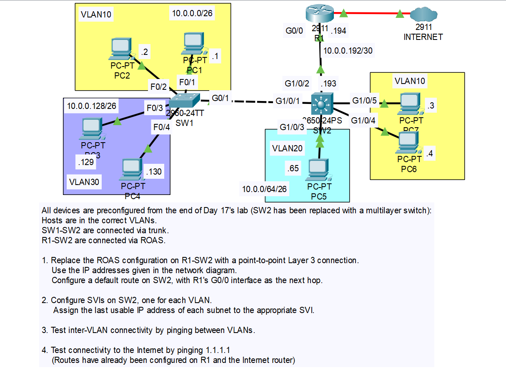
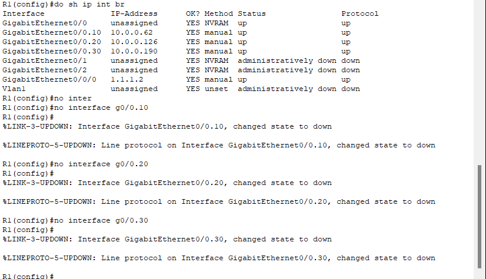
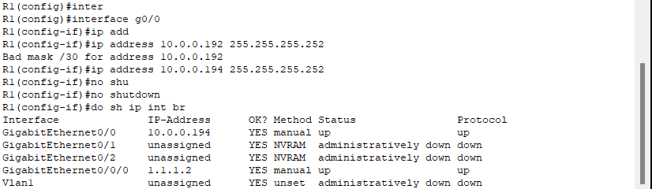
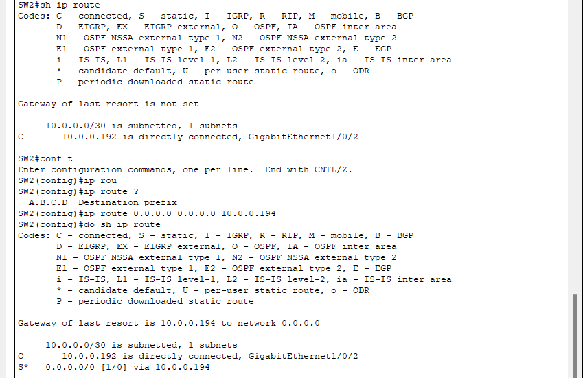
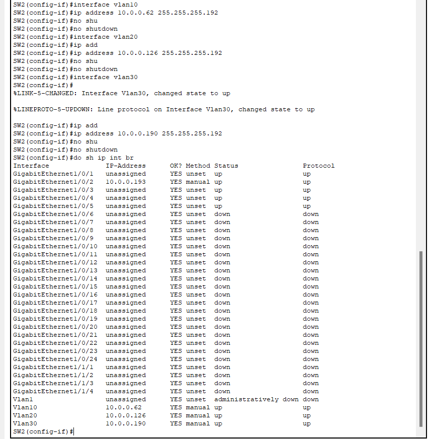
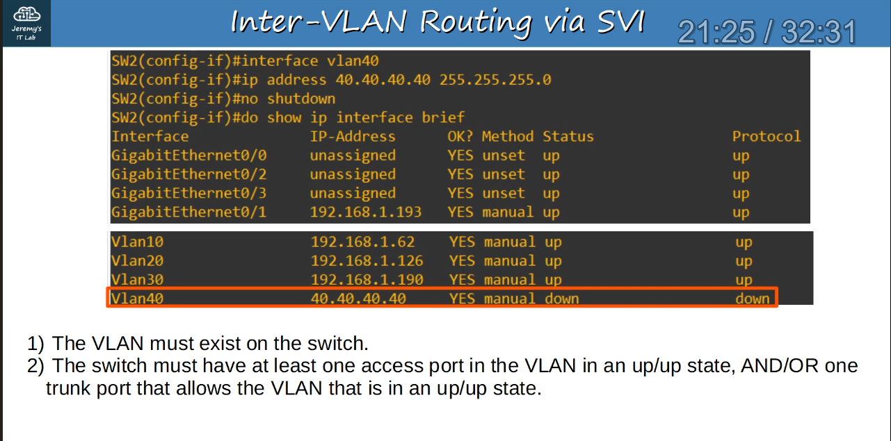
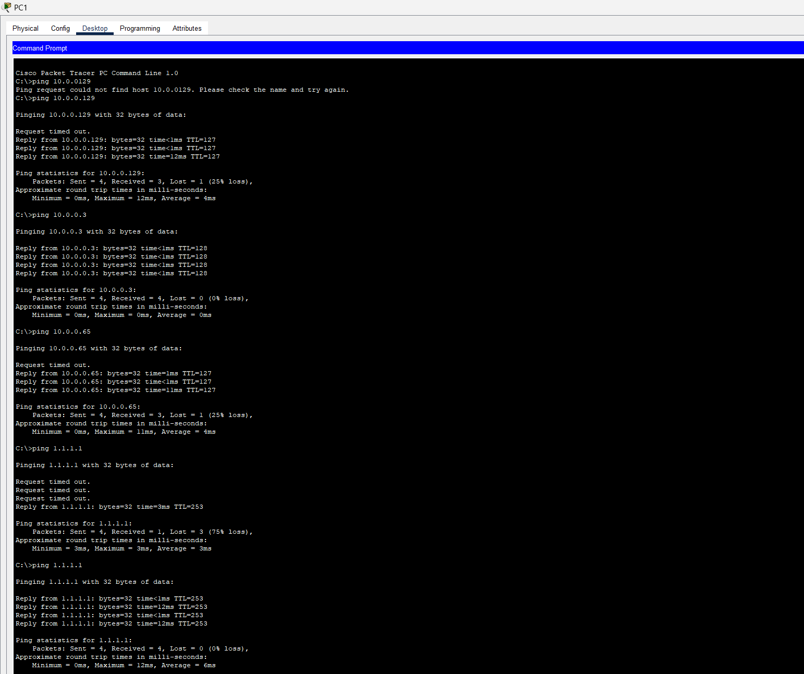

# CONTENTS

## [LAB](#lab)
### [Q1](#q1), [Q2](#q2), [Q3-4](#q3-4), [Commands](#commands), [Notes](#notes)

### <a name="lab"></a>LAB



### <a name="q1"></a>Q1

- R1:




- SW2:
```
SW2(config)#default interface g1/0/2
SW2(config)#ip routing
SW2(config)#interface g1/0/2
SW2(config-if)#no switchport 
SW2(config-if)#ip address 10.0.0.193 255.255.255.252
SW2(config-if)#no shutdown 
```

### <a name="q2"></a>Q2





### <a name="q3-4"></a>Q3-4



### <a name="commands"></a>Commands

### <a name="notes"></a>Notes


