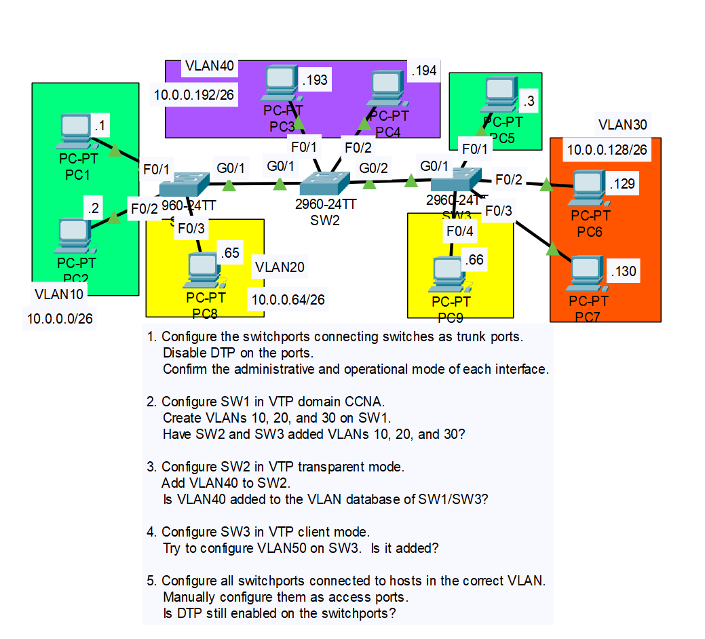

# CONTENTS

## [LAB](#lab)
### [Q1](#q1), [Q2](#q2), [Q3](#q3), [Q4](#q4), [Commands](#commands), [Notes](#notes)

### <a name="lab"></a>LAB



### <a name="q1"></a>Q1


```
SW1(config)#interface g0/1
SW1(config-if)#switchport mode trunk 
SW1(config-if)#switchport nonegotiate
```

### <a name="q2"></a>Q2


### <a name="q3"></a>Q3


### <a name="q4"></a>Q4


### <a name="q5"></a>Q5

```
.
.
.
SW1(config)#interface f0/3
SW1(config-if)#switchport mode access(also disables dtp - no need "switchport nonegotiate")
SW1(config-if)#switchport access vlan 20
.
.
.
```

### <a name="commands"></a>Commands

```
SW1>show interfaces g0/1 switchPort
```

### <a name="notes"></a>Notes