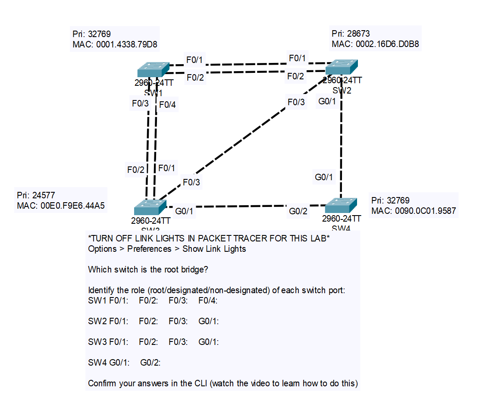

# CONTENTS

## [LAB](#lab)
### [Q1](#q1), [Commands](#commands), [Notes](#notes)

### <a name="lab"></a>LAB



### <a name="q1"></a>Q1

- Root Bridge: SW2

- SW2:
    - F0/1: Designated
    - F0/2: Designated
    - F0/3: Designated
    - G0/1: Designated

- SW1:
    - F0/4: Root
    - F0/3: Non-designated
    - F0/1: Non-Designated
    - F0/2: Non-Designated

- SW2:
    - G0/1: Root
    - F0/3: Non-designated
    - F0/1: Designated
    - F0/2: Designated

- SW4: 
    - G0/2: Root
    - G0/1: Designated

### <a name="confirm"></a>Confirm

```
..
SW1>show spanning-tree
..

SW2
.
.
```

### <a name="commands"></a>Commands

### <a name="notes"></a>Notes


