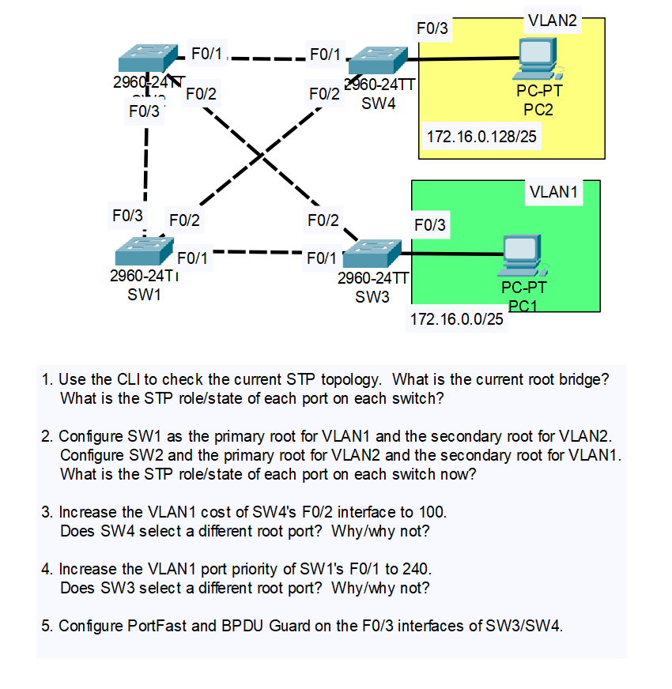
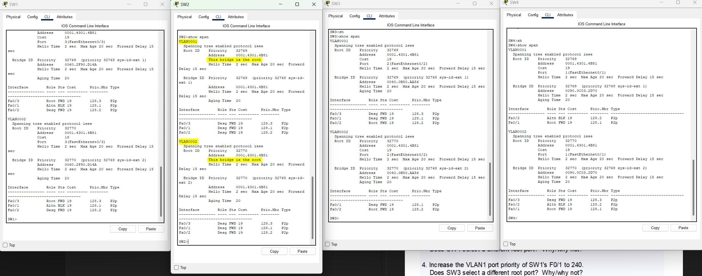
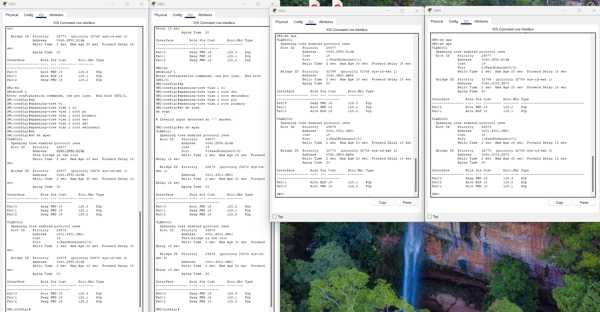
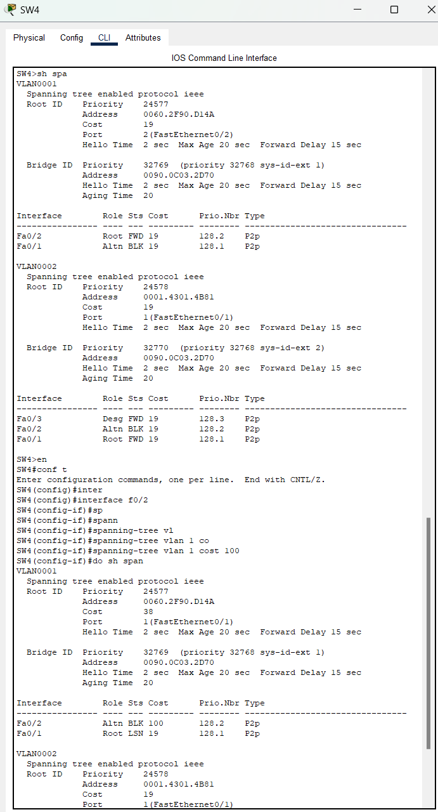
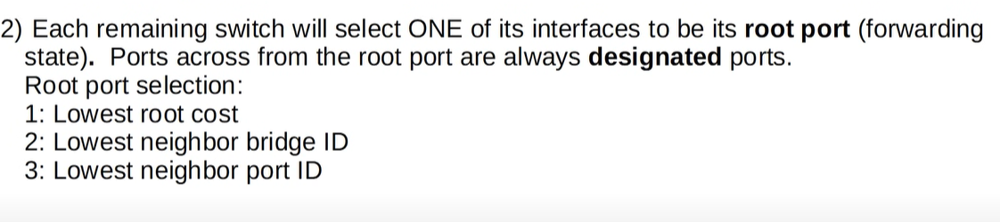
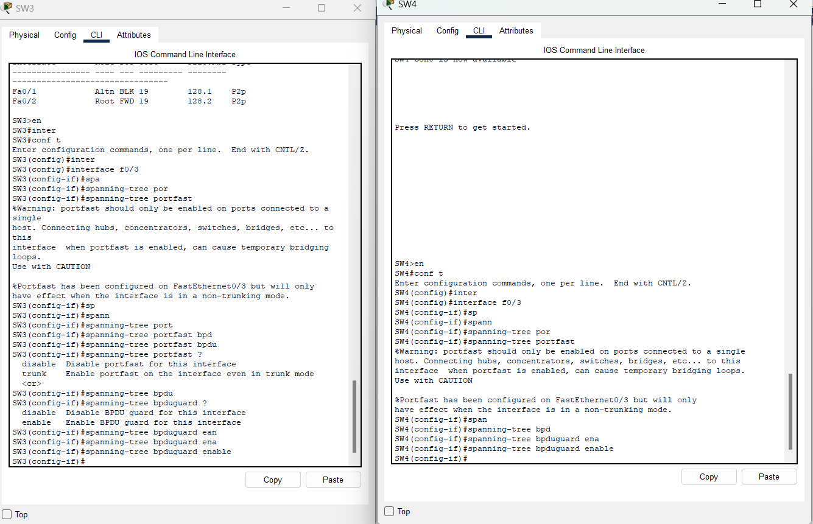

# CONTENTS

## [LAB](#lab)
### [Q1](#q1), [Q2](#q2), [Q2](#q2), [Q3](#q3), [Q4](#q4), [Q5](#q5), [Commands](#commands), [Notes](#notes)

### LAB

### Q1

### Q2

### Q3

- Yes.

### Q4

- No. It is last tie-breaker.

### Q5

### Commands

### Notes