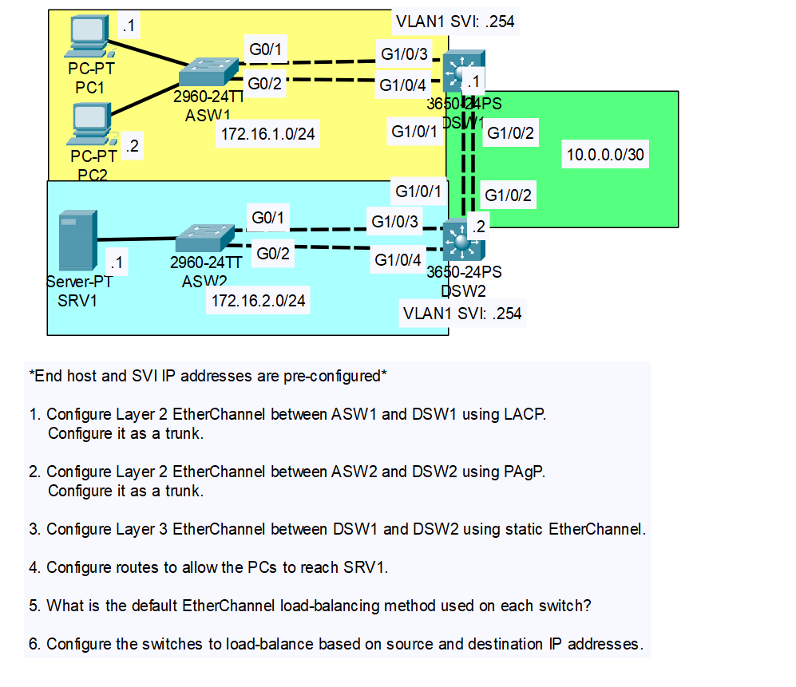

# CONTENTS

## [LAB](#lab)
### [Q1-2](#q1-2), [Q3](#q3), [Q4](#q4), [Q5](#q5), [Q6](#q6), [Commands](#commands), [Notes](#notes)

### <a name="lab"></a>LAB



### <a name="q1-2"></a>Q1-2

```
.
.
.
## ASW2 arayüzleri için:
ASW2>en
ASW2#conf t
ASW2(config)#interface range g0/1-2
ASW2(config-if-range)#channel-group 1 mode desirable(lacp için active komutu vs.)
ASW2(config-if-range)#
ASW2(config-if-range)#inter po1
ASW2(config-if)#switchport mode trunk 
ASW2(config-if)#

## helpers
ASW2#show ip int brief
ASW2#show interfaces trunk
ASW2#show etherchannel summary
.
.
.
```

### <a name="q3"></a>Q3

```
.
.
.
DSW2(config)#int range g1/0/1-2
DSW2(config-if-range)#no switchport
DSW2(config-if-range)#channel-group 2 mod on
DSW2(config-if-range)#int po2
DSW2(config-if)#ip add 10.0.0.2 255.255.255.2
.
.
.
```
> DSW1 - DSW2 ping atar.

### <a name="q4"></a>Q4

```
.
.
.
DSW2(config)#ip routing
.
.
.
```

### <a name="q5"></a>Q5

```
DSW2(config)#do sh eth load-balance
```

### <a name="q6"></a>Q6

```
DSW2(config)#port-channel load-balance src-dst-ip
```

### <a name="commands"></a>Commands

### <a name="notes"></a>Notes