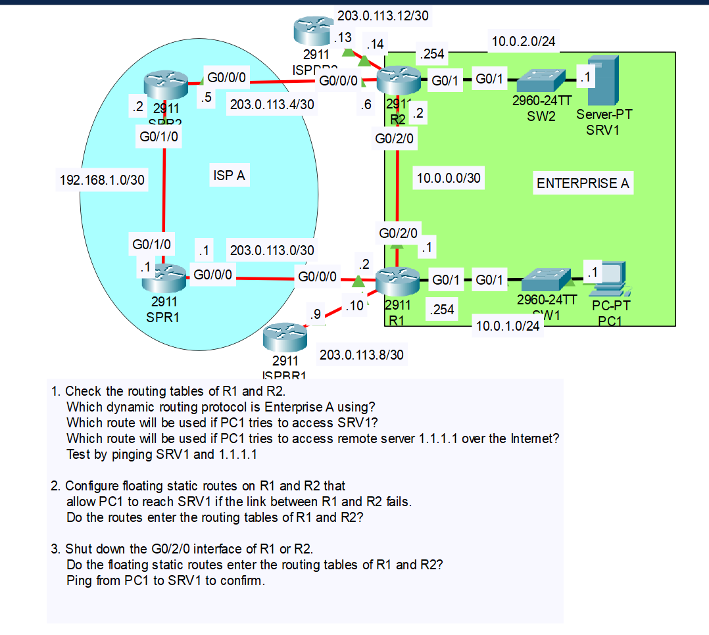
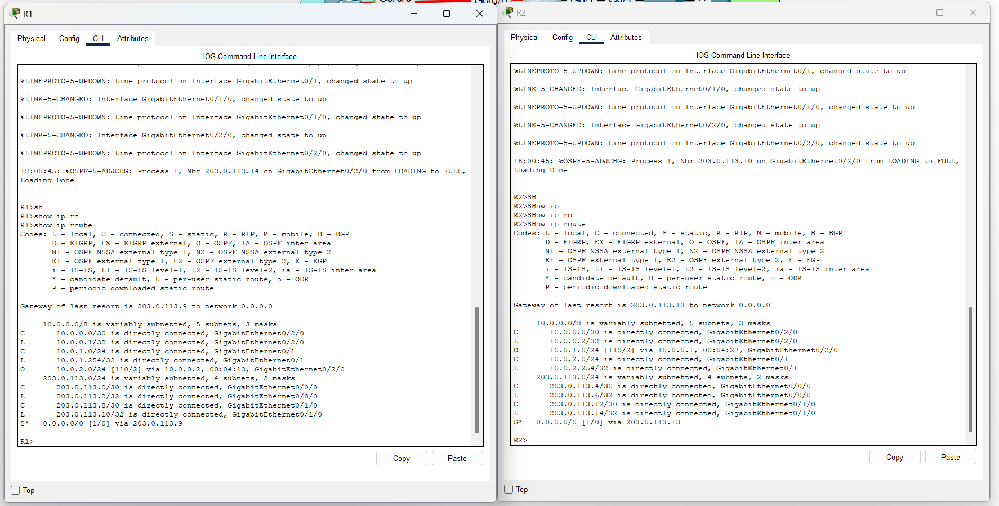
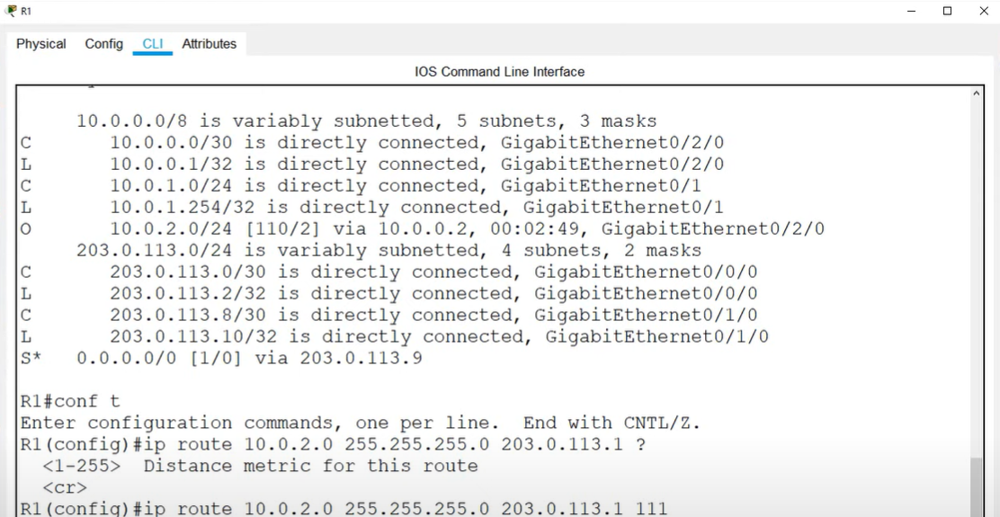
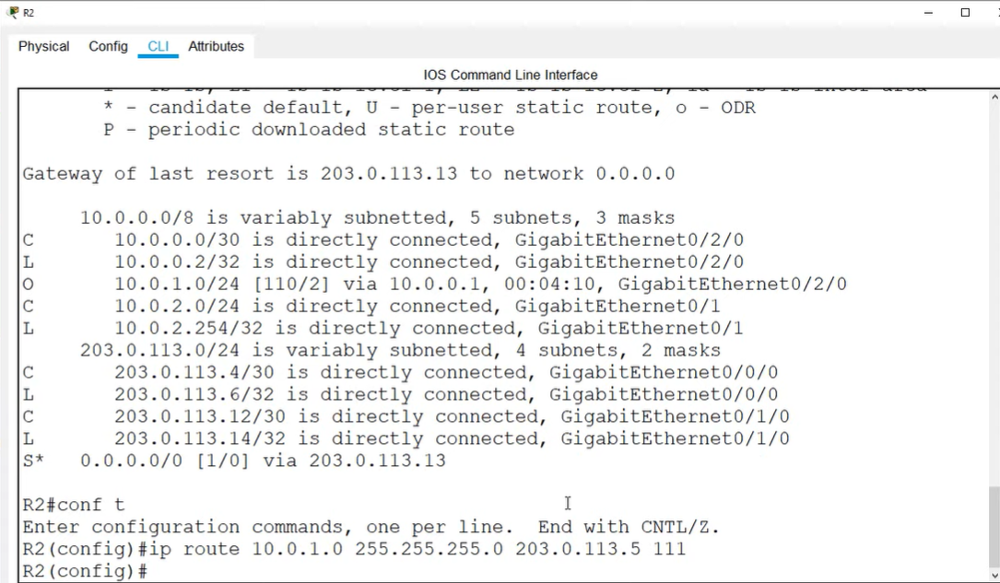
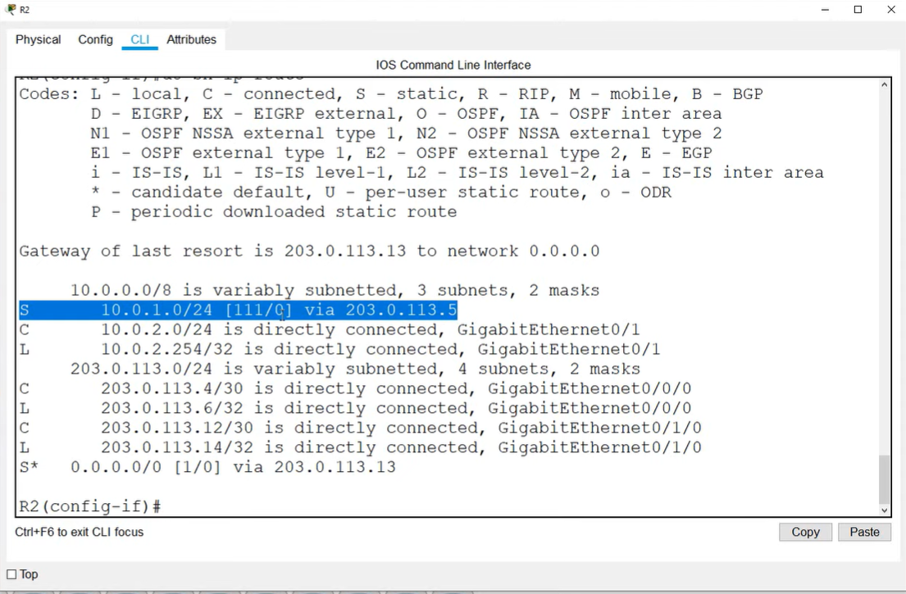

# CONTENTS

## [LAB](#lab)
### [Q1](#q1), [Q2](#q2), [Q3](#q3), [Commands](#commands), [Notes](#notes)

### LAB

### Q1

- 1.1
    - 

- 1.2 
    - PC1 - SW1 - R1 - R2 - SW2 SRV1

- 1.3 
    - PC1 - SW1 - R1 - ISPBR1

### Q2

### Q3

### Commands

### Notes

