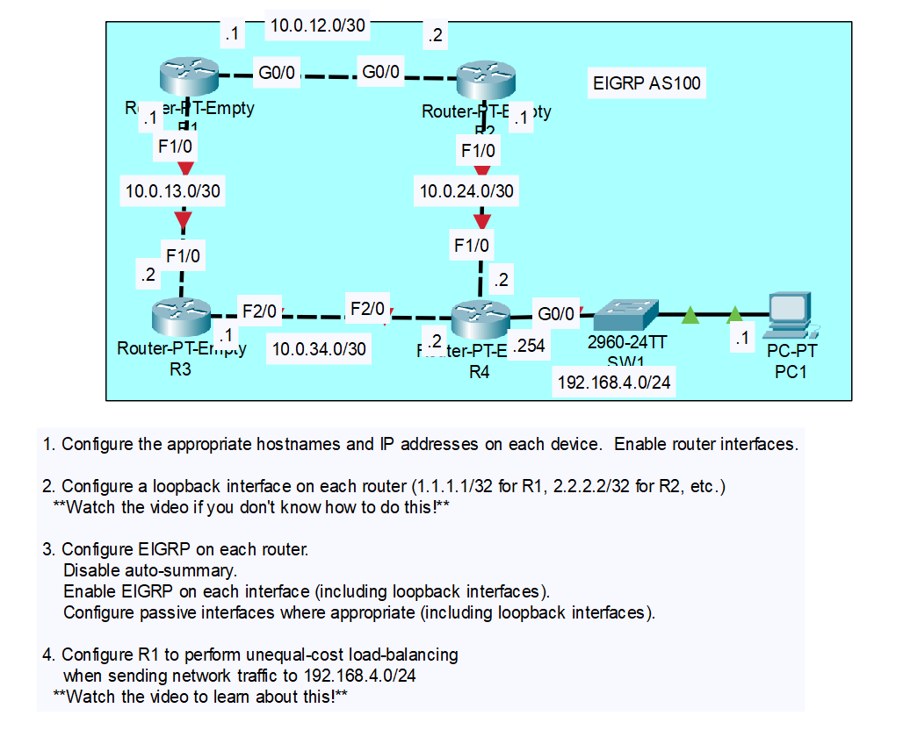
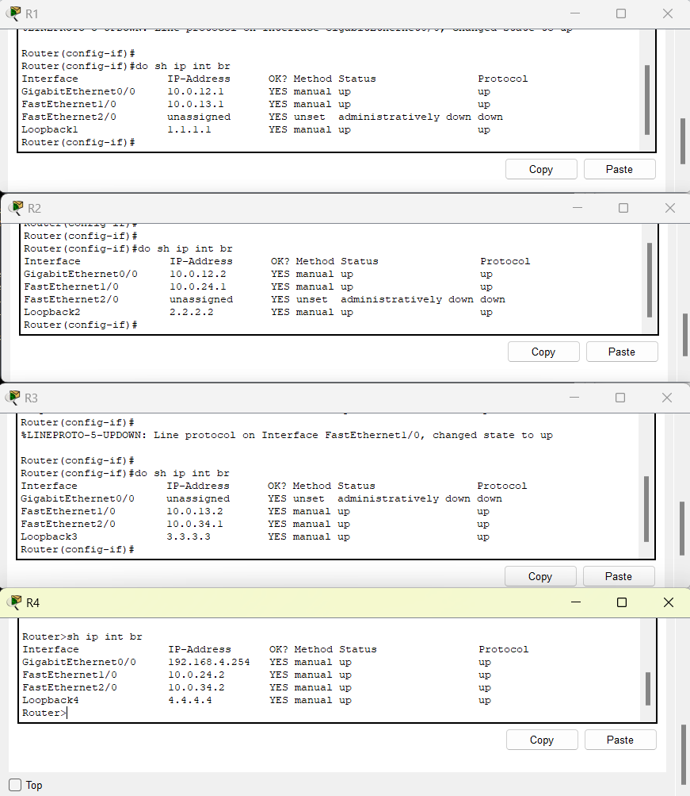
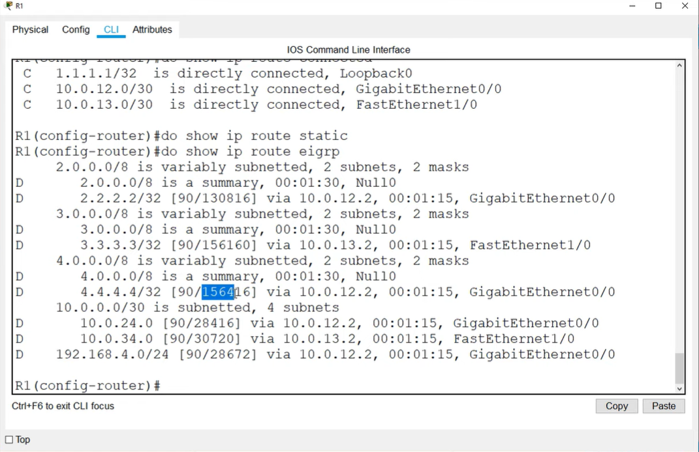
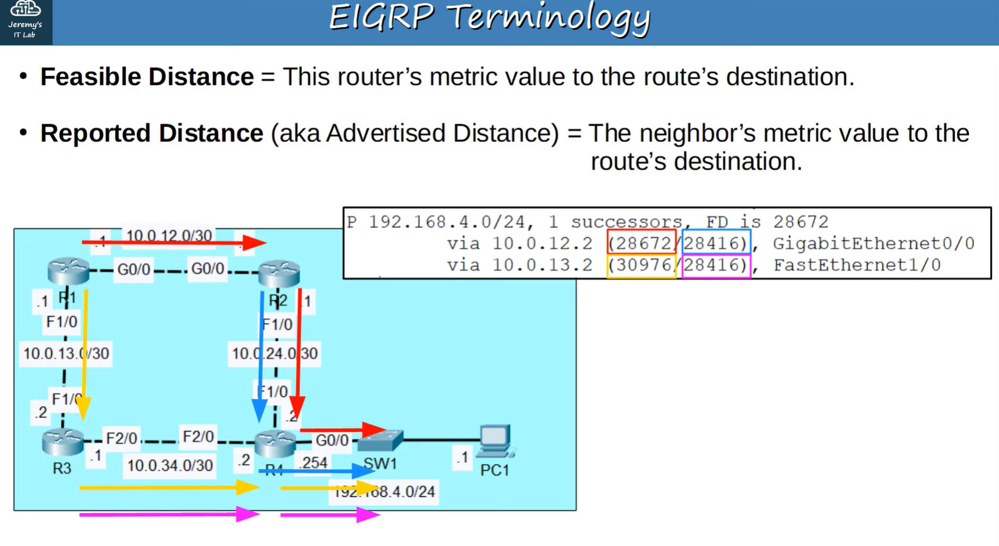
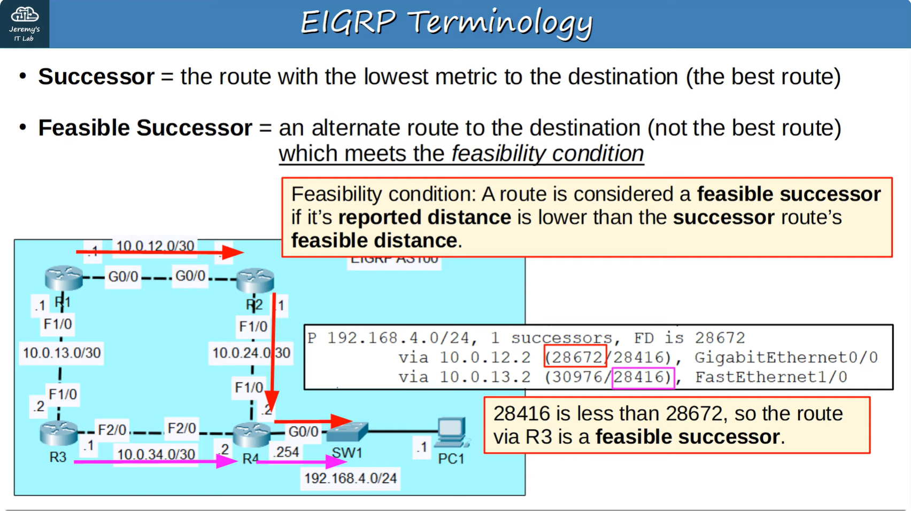
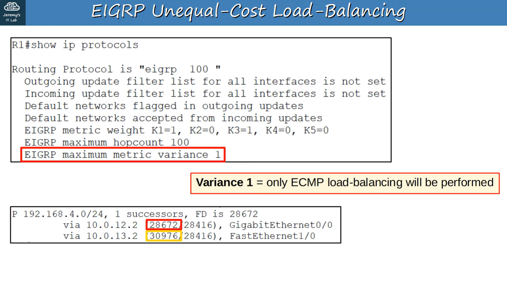
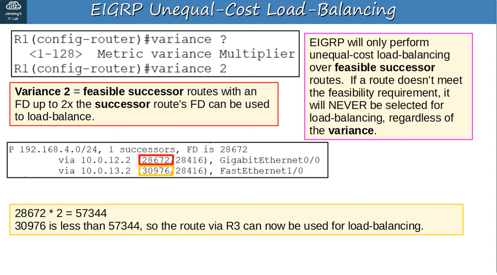
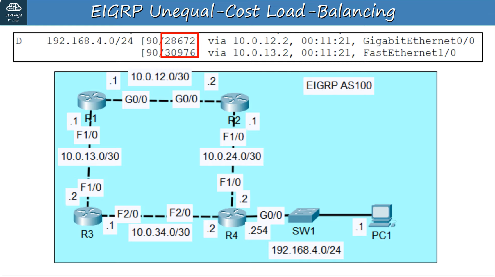

# CONTENTS

## [LAB](#lab)
### [Q1-2](#q1-2), [Q3](#q3), [Q4](#q4), [Commands](#commands), [Notes](#notes)

### <a name="lab"></a>LAB



### <a name="q1-2"></a>Q1-2

```
.
.
.
Router(config)#interface loopback 2

Router(config-if)#
%LINK-5-CHANGED: Interface Loopback2, changed state to up

%LINEPROTO-5-UPDOWN: Line protocol on Interface Loopback2, changed state to up

Router(config-if)#ip address 2.2.2.2 255.255.255.255
.
.
.
```



### <a name="q3"></a>Q3

```
R3(config)#router eigrp 100
R3(config-router)#network 10.0.13.0 0.0.0.3
R3(config-router)#network 10.0.34.0 0.0.0.3
R3(config-router)#network 3.3.3.3 0.0.0.0
R3(config-router)#no auto-summary
R3(config-router)#passive-interface l3

.
.
.
R3(config-router)#do sh ip protocols
.
.
.
R3(config-router)#do sh ip eigrp neighbors
.
.
.
.
R3(config-router)#do sh ip eigrp topology
.
.
.
.
R3(config-router)#do sh ip route eigrp
R3(config-router)#do sh ip route static
.
.
.

```



### <a name="q4"></a>Q4








### <a name="commands"></a>Commands

### <a name="notes"></a>Notes

FEASIBILITY REQUIREMENT: LOOP PREVENTION MECHANISM