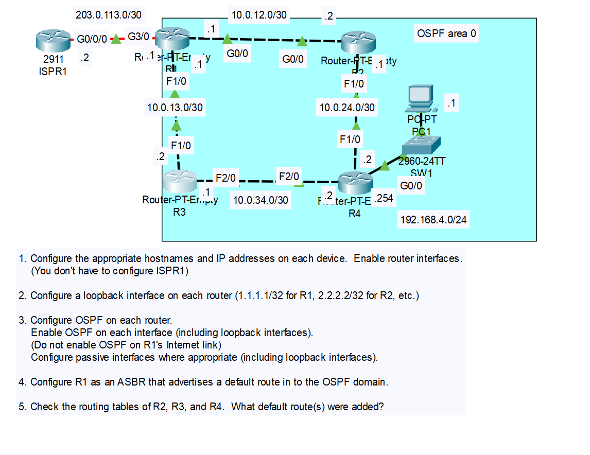
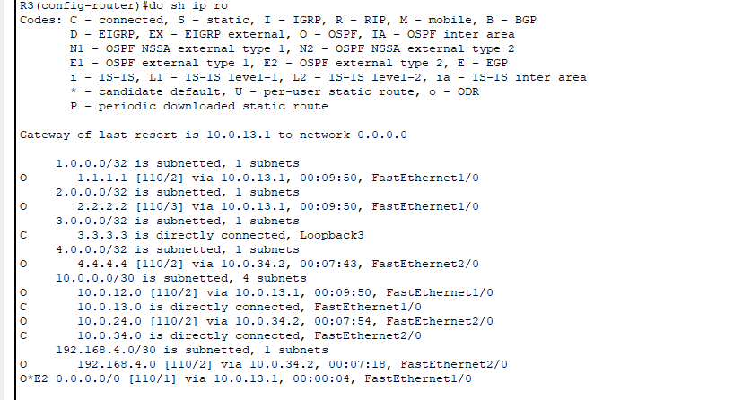

# CONTENTS

## [LAB](#lab)
### [Q1-2-3-4-5](#q1-2-3-4-5) ,[Commands](#commands), [Notes](#notes)

### <a name="lab"></a>LAB



### <a name="q1-2-3-4-5"></a>Q1-2-3-4-5
- Sadece R1 komutları:
```
Router#conf t
Router(config)#hostname R1
R1(config)#interface loopback 1
R1(config-if)#ip address 1.1.1.1 255.255.255.255
R1(config-if)#inter g3/0
R1(config-if)#ip address 203.0.113.1 255.255.255.252
R1(config-if)#no shutdown 
R1(config-if)#inter f1/0
R1(config-if)#ip address 10.0.13.1 255.255.255.252
R1(config-if)#no shutdown 
R1(config-if)#inter g0/0
R1(config-if)#ip address 10.0.12.1 255.255.255.252
R1(config-if)#no shutdown 
.
.
.
R1(config)#router ospf 1
R1(config-router)#netw
R1(config-router)#network 10.0.13.0 0.0.0.3 area 0
R1(config-router)#network 10.0.12.0 0.0.0.3 area 0
R1(config-router)#network 1.1.1.1 0.0.0.0 area 0
R1(config-router)#passive-interface loopback 1
.
.
.
R1(config)#ip route 0.0.0.0 0.0.0.0 203.0.113.2 
R1(config)#router ospf 1
R1(config-router)#default-information originate 
```



### <a name="commands"></a>Commands

### <a name="notes"></a>Notes


