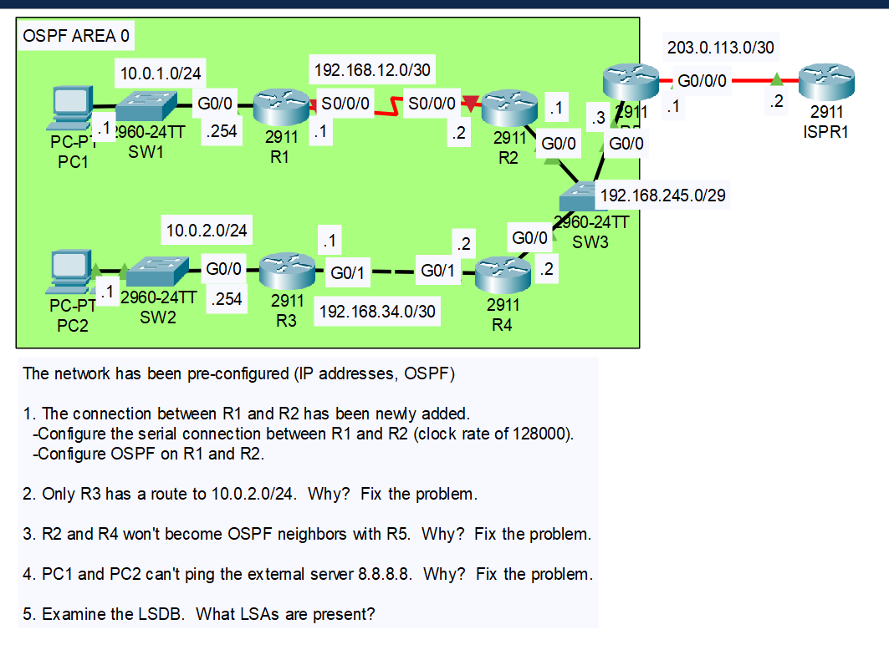
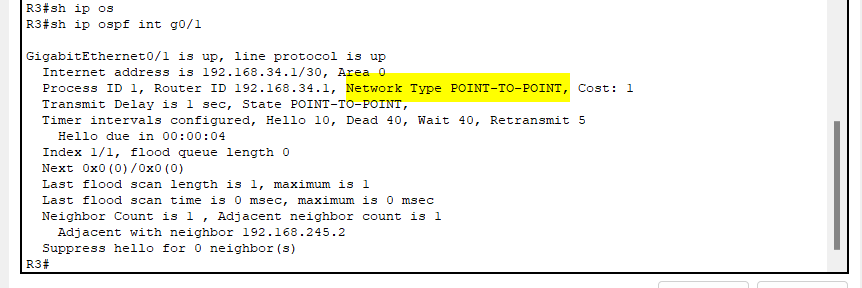
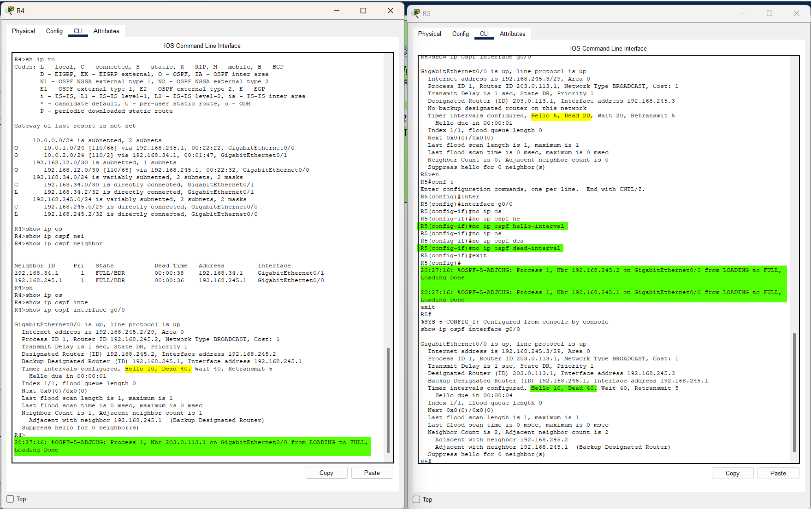
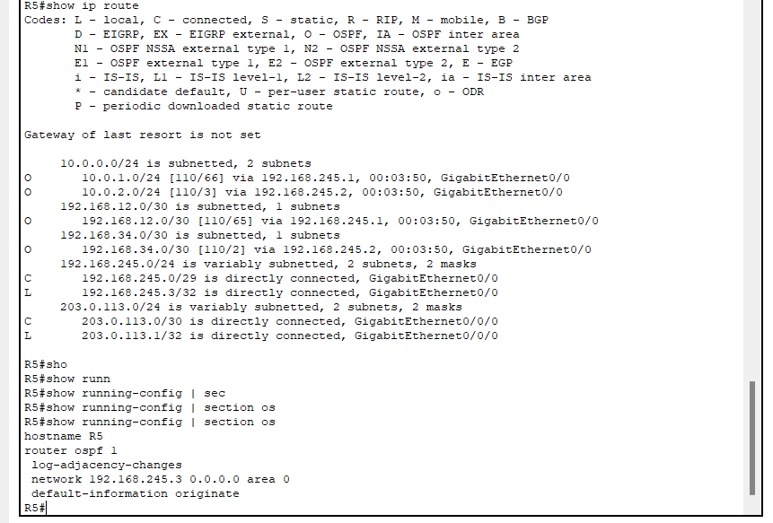
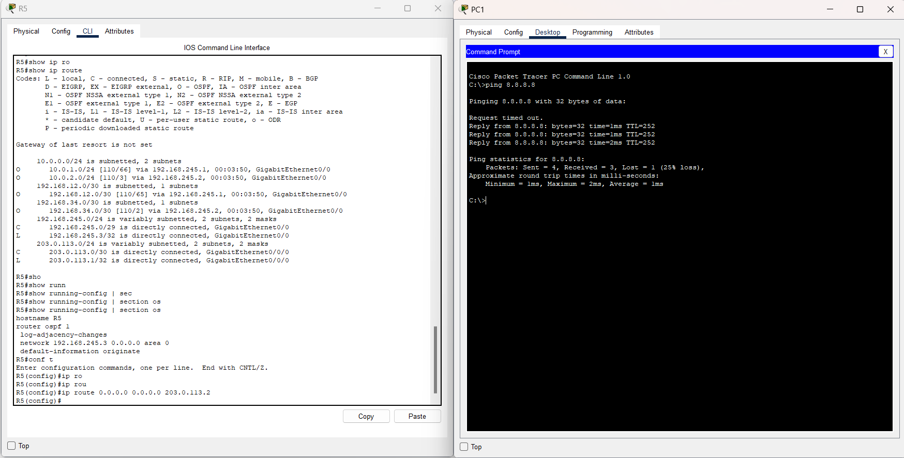

# CONTENTS

## [LAB](#lab)
### [Q1](#q1), [Q2](#q2), [Q3](#q3), [Commands](#commands), [Notes](#notes)

### <a name="lab"></a>LAB



### <a name="q1"></a>Q1
- Learning area number:

    ```
    R2(config)#do sh ip ospf inter br
    ```
    ```
    Interface     PID   Area                     IP Address/Mask          Cost  State  Nbrs F/C
    Gig0/0          1   0                  192.168.245.1/255.255.255.248   1      BDR  0/0
    ```

- Learning DCE/DTE side:
    ```
    R1(config-router)#do sh controller s0/0/0
    ```
    ```
    Interface Serial0/0/0
    Hardware is PowerQUICC MPC860
    DCE V.35, clock rate 2000000
    .
    .
    .
    ```

### <a name="q2"></a>Q2
- They have full ospf adjacency but they have network types mismatch.

  

- Fix:
    ```
    R3(config)#inter g0/1
    R3(config-if)#no ip ospf network point-to-point
    R3(config-if)#
    20:18:59: %OSPF-5-ADJCHG: Process 1, Nbr 192.168.245.2 on GigabitEthernet0/1 from FULL to DOWN, Neighbor Down: Interface down or detached

    20:18:59: %OSPF-5-ADJCHG: Process 1, Nbr 192.168.245.2 on GigabitEthernet0/1 from LOADING to FULL, Loading Done
    ```

### <a name="q3"></a>Q3



### <a name="q4"></a>Q4
- ```default-infomation originate``` komutu girilmiş fakat ***default route*** ayarlanmamış,

    

    

```
R2>sh ip ospf database 
```

- Type 1, type 2, type 5

```
            OSPF Router with ID (192.168.245.1) (Process ID 1)

                Router Link States (Area 0)

Link ID         ADV Router      Age         Seq#       Checksum Link count
192.168.34.1    192.168.34.1    1177        0x8000000b 0x00e614 2
203.0.113.1     203.0.113.1     683         0x80000007 0x007e8d 1
192.168.245.2   192.168.245.2   683         0x8000000b 0x005841 2
192.168.245.1   192.168.245.1   683         0x80000009 0x0073c3 3
10.0.1.254      10.0.1.254      614         0x80000004 0x00b693 3

                Net Link States (Area 0)
Link ID         ADV Router      Age         Seq#       Checksum
192.168.245.3   203.0.113.1     683         0x80000002 0x007b76
192.168.34.2    192.168.245.2   399         0x8000000b 0x00561f

                Type-5 AS External Link States
Link ID         ADV Router      Age         Seq#       Checksum Tag
0.0.0.0         203.0.113.1     80          0x80000001 0x00d2c1 1
```

### <a name="commands"></a>Commands

### <a name="notes"></a>Notes