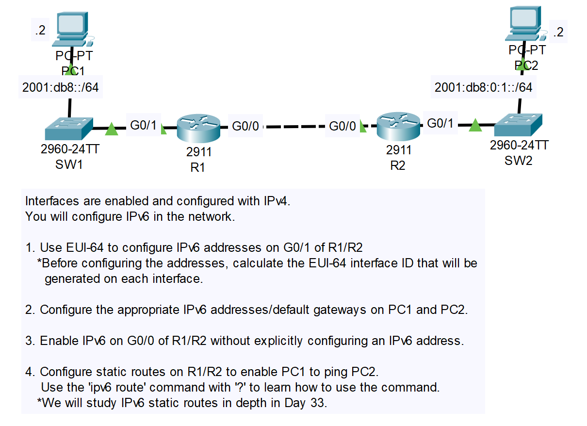
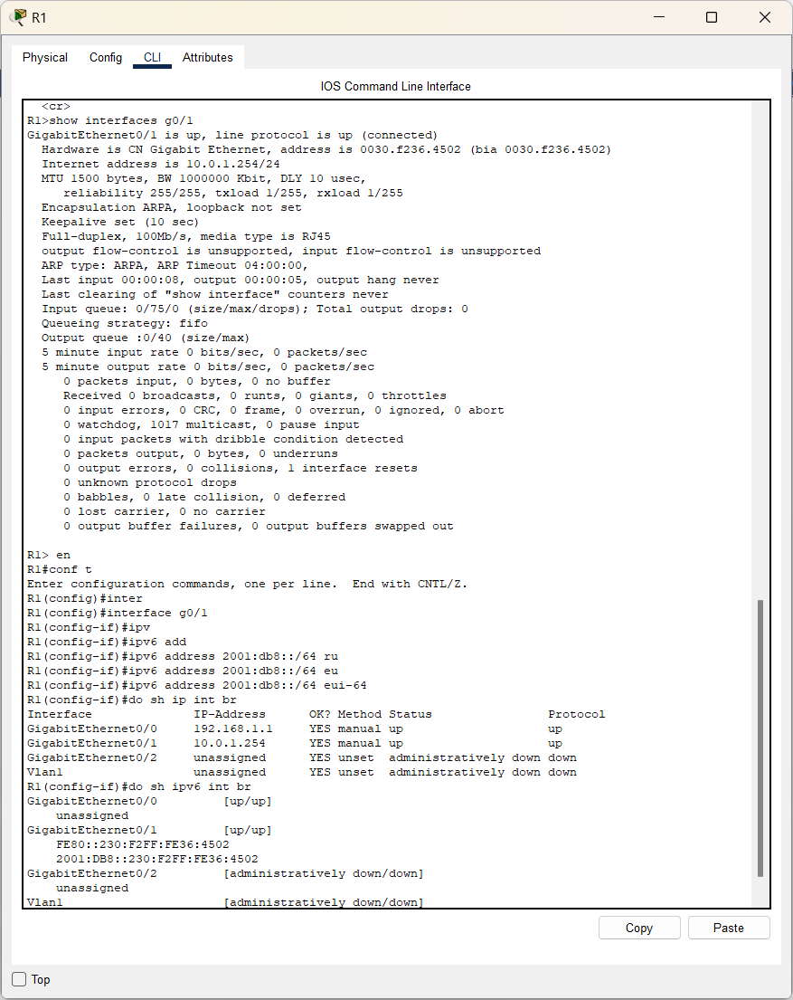
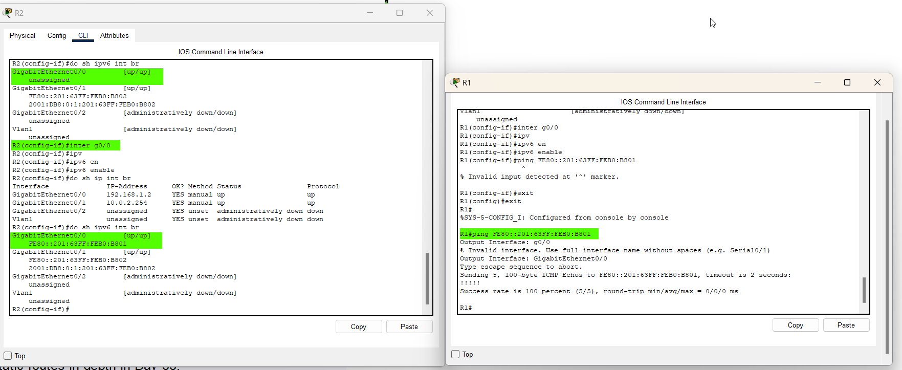
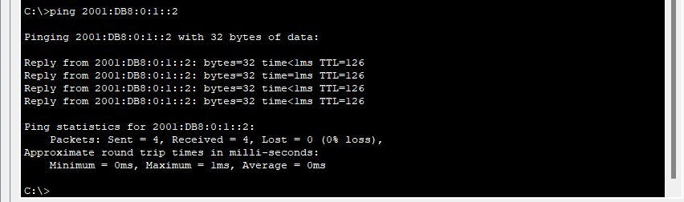

# CONTENTS

## [LAB](#lab)
### [Q1-2-3](#q1-2-3), [Q4](#q4), [Commands](#commands), [Notes](#notes)

### <a name="lab"></a>LAB



### <a name="q1-2-3"></a>Q1

```
R1>show interfaces g0/1
```
```
GigabitEthernet0/1 is up, line protocol is up (connected)
  Hardware is CN Gigabit Ethernet, address is 0030.f236.4502 (bia 0030.f236.4502)
  .
  .
  .
```
```
    Interface Identifier
    ---
        Step 1: 0030.f236.4502
        Step 2: 0030.f2ff.fe36.4502
        Step 3: 0000 -> 0010 (Second Hex)
        Step 4: 0230.f2ff.fe36.4502

    Global Routing Address:
    ---
        2001:db8::230.f2ff.fe36.4502/64
```





### <a name="q4"></a>Q4

```
R1(config)#ipv6 route 2001:db8:0:1::/64 g0/0 FE80::201:63FF:FEB0:B801 
R1(config)#do sh ipv6 int br
GigabitEthernet0/0         [up/up]
    FE80::230:F2FF:FE36:4501
GigabitEthernet0/1         [up/up]
    FE80::230:F2FF:FE36:4502
    2001:DB8::230:F2FF:FE36:4502
.
.
.
## !!! Bu olmadan route çalışmaz
R1(config)#ipv6 unicast-routing
## !!! Bu olmadan route çalışmaz

.
.
.
R2
.
.
.

```



### <a name="commands"></a>Commands

### <a name="notes"></a>Notes