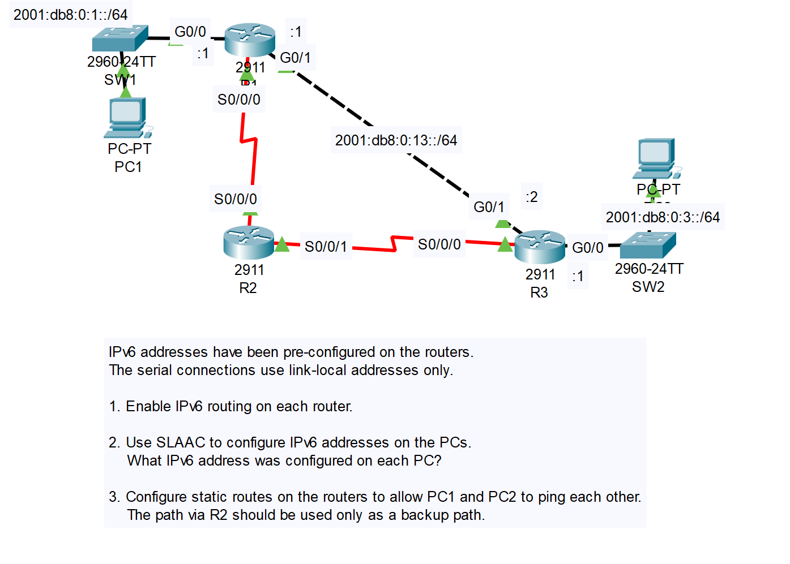
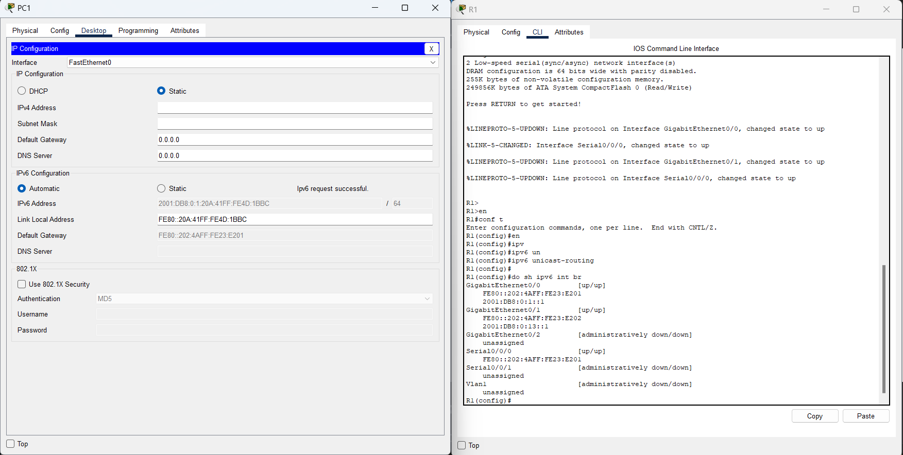
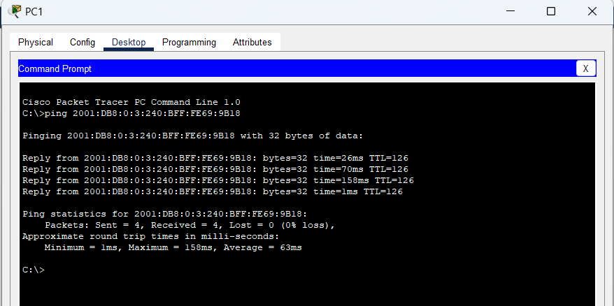
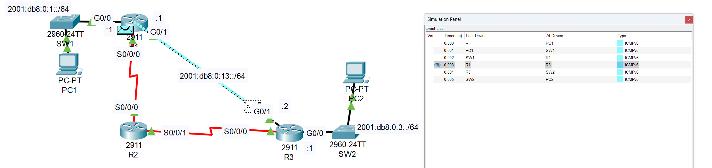
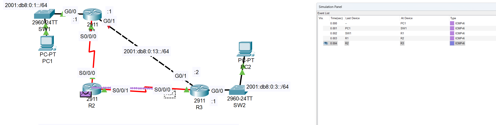

# CONTENTS

## [LAB](#lab)
### [Q1-2](#q1-2), [Q3](#q3), [Commands](#commands), [Notes](#notes)

### LAB

### Q1-2

### Q3

- R2 as backup R1-R3 connection active: 
    
- When R1-R3 connection failed, R2 is take over:
    

### Commands

### Notes