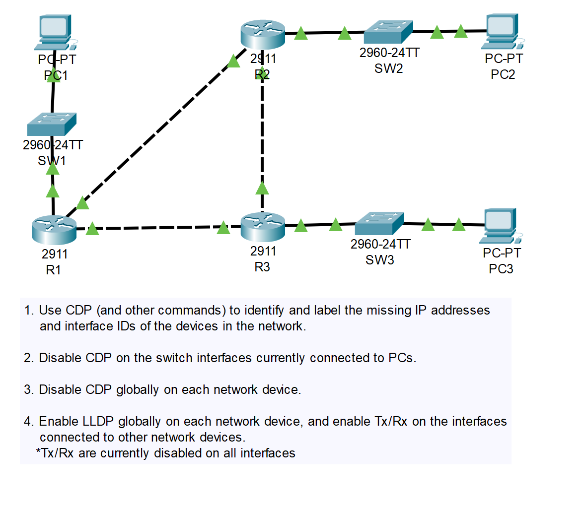
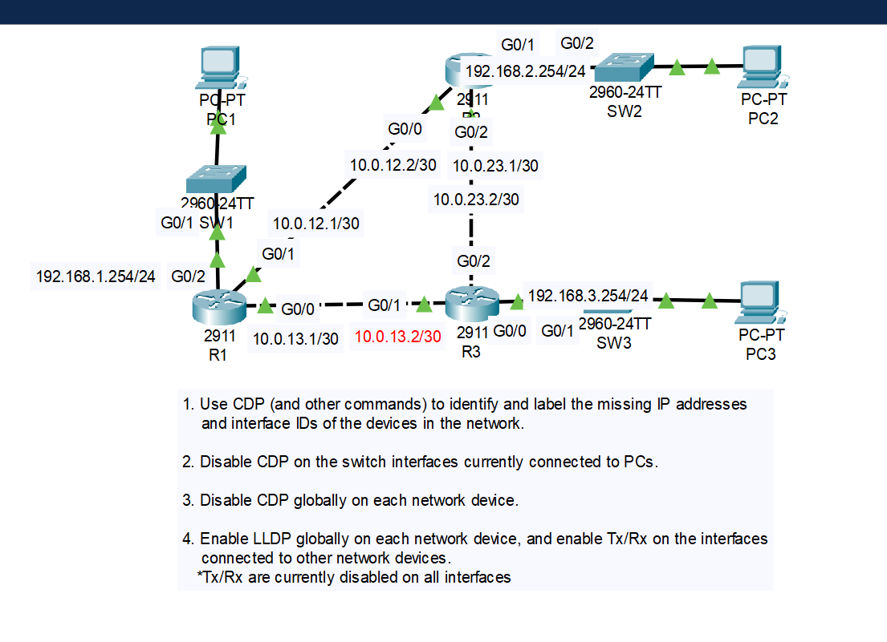

# CONTENTS

## [LAB](#lab)
### [Q1](#q1), [Q2](#q2), [Q3](#q3), [Q4](#q4), [Commands](#commands), [Notes](#notes)

### <a name="lab"></a>LAB



### <a name="q1"></a>Q1

```
R1>show cdp neighbors
R1>show ip int
SW1(config)#do sh ip int br
```



### <a name="q2"></a>Q2

```
.
.
SW2(config)#interface f0/1
SW2(config-if)#no cdp enable
SW2(config)#do sh cdp interf
.
. 
```

### <a name="q3"></a>Q3

```
.
.
SW1(config)#no cdp run
.
.
```

### <a name="q4"></a>Q4

```
R3(config)#lldp run 
################### For R3 g0/1 interface ##################
R3(config)#interface g0/1
R3(config-if)#lldp transmit 
R3(config-if)#lldp receive 
R3(config-if)#exit
R3(config)#exit
.
.
```

```
## Verify
R3#show lldp neighbors 
```

### <a name="commands"></a>Commands

### <a name="notes"></a>Notes