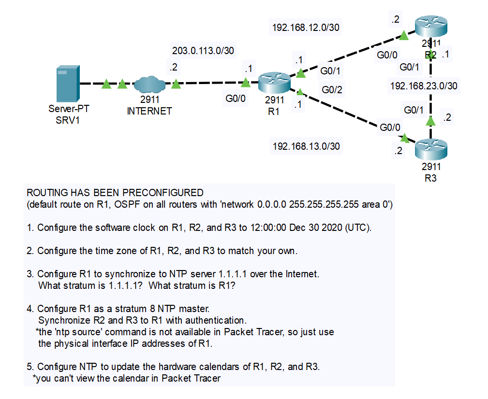
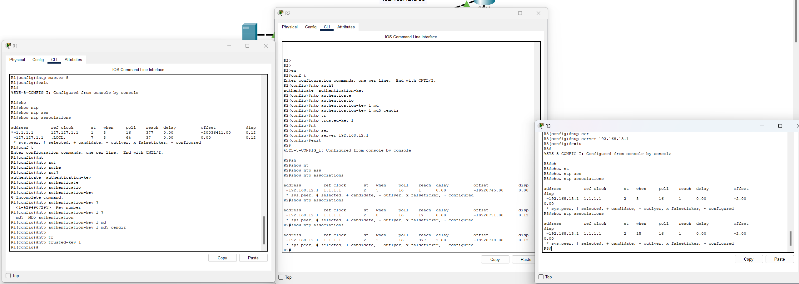

# CONTENTS

## [LAB](#lab)
### [Q1](#q1), [Commands](#commands), [Notes](#notes)

### <a name="lab"></a>LAB



### <a name="q1"></a>Q1

```
R2#clock set 12:00:00 30 Dec 2020
```

### <a name="q2"></a>Q2

```
R2(config)#clock timezone UTC+3 3
```

### <a name="q3"></a>Q3

```
R1(config)#ntp server 1.1.1.1
R1(config)#exit
R1#
%SYS-5-CONFIG_I: Configured from console by console
R1#show ntp associations 

address         ref clock       st   when     poll    reach  delay          offset            disp
 ~1.1.1.1       127.127.1.1     1    0        16      1      0.00           -20036411.00      0.00
 * sys.peer, # selected, + candidate, - outlyer, x falseticker, ~ configured
R1#
```

### <a name="q4"></a>Q4



### <a name="q5"></a>Q5

```
R3(config)#ntp update-calendar
```

### <a name="commands"></a>Commands

### <a name="notes"></a>Notes