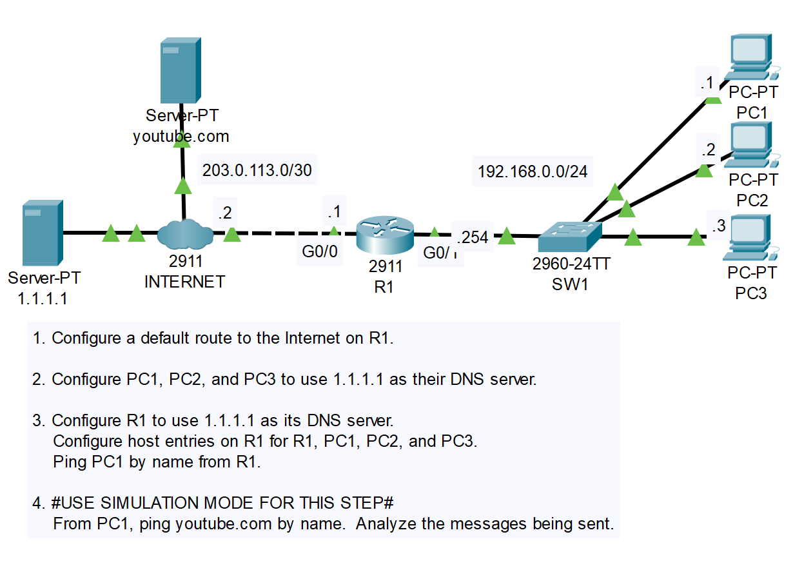
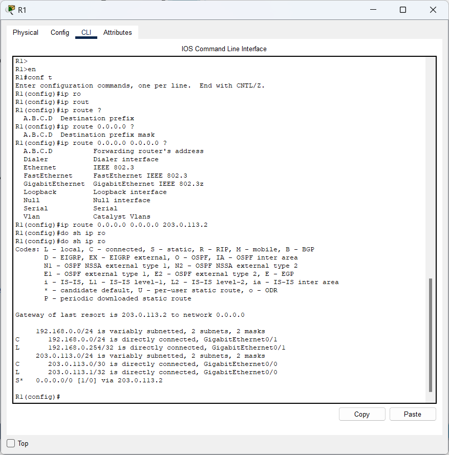
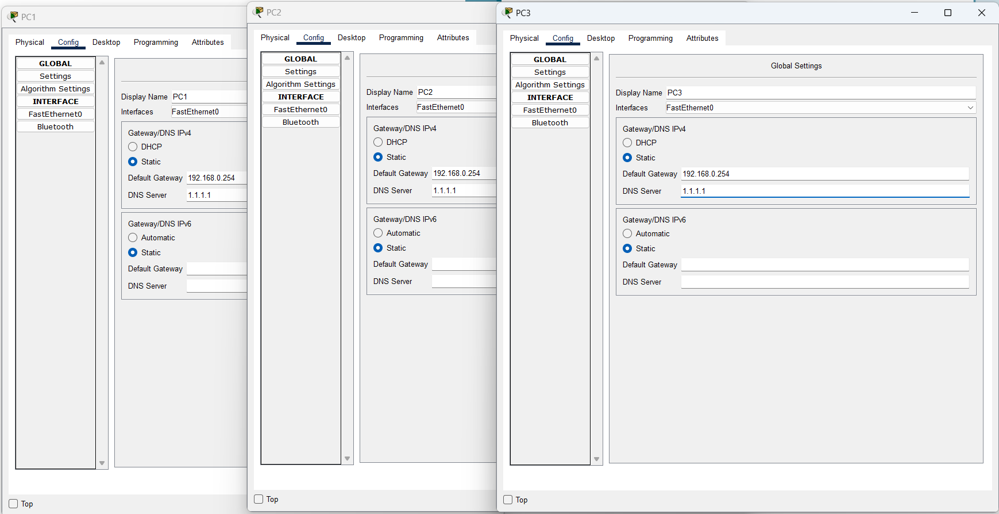
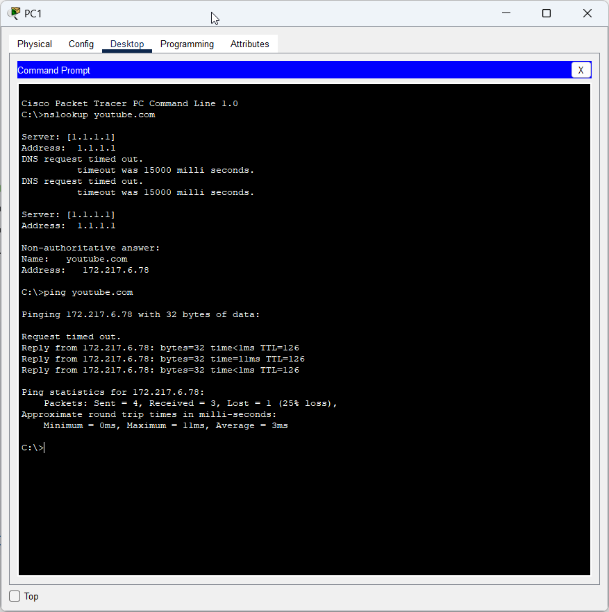
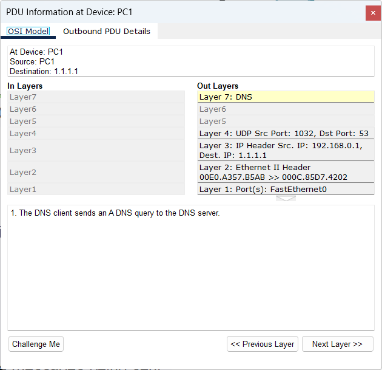
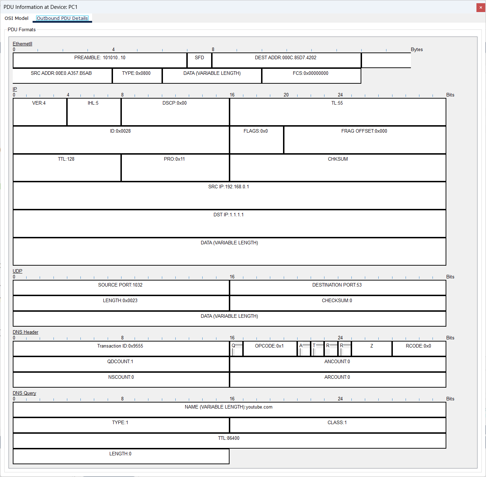

# CONTENTS

## [LAB](#lab)
### [Q1](#q1), [Commands](#commands), [Notes](#notes)

### <a name="lab"></a>LAB



### <a name="q1"></a>Q1



### <a name="q2"></a>Q2




### <a name="q3"></a>Q3

```
R1(config)#ip host R1 192.168.0.254
R1(config)#ip host PC1 192.168.0.1
R1(config)#ip host PC2 192.168.0.2
R1(config)#ip host PC3 192.168.0.3

R1(config)#ip name-server 1.1.1.1

R1#show hosts 
Default Domain is not set
Name/address lookup uses domain service
Name servers are 1.1.1.1

Codes: UN - unknown, EX - expired, OK - OK, ?? - revalidate
       temp - temporary, perm - permanent
       NA - Not Applicable None - Not defined

Host                      Port  Flags      Age Type   Address(es)
PC1                       None  (perm, OK)  0   IP      192.168.0.1
PC2                       None  (perm, OK)  0   IP      192.168.0.2
PC3                       None  (perm, OK)  0   IP      192.168.0.3
R1                        None  (perm, OK)  0   IP      192.168.0.254
R1#ping PC1

Type escape sequence to abort.
Sending 5, 100-byte ICMP Echos to 192.168.0.1, timeout is 2 seconds:
!!!!!
Success rate is 100 percent (5/5), round-trip min/avg/max = 0/2/13 ms
```

### <a name="q4"></a>Q4




### <a name="commands"></a>Commands

### <a name="notes"></a>Notes