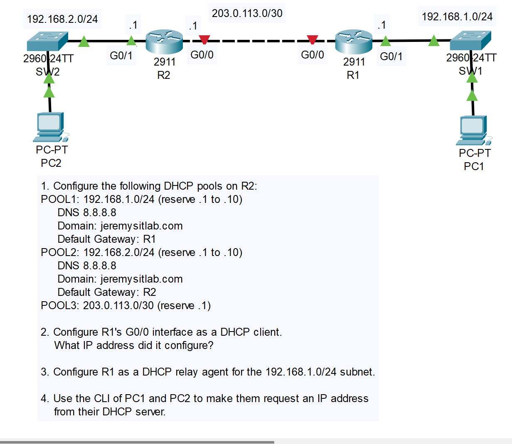
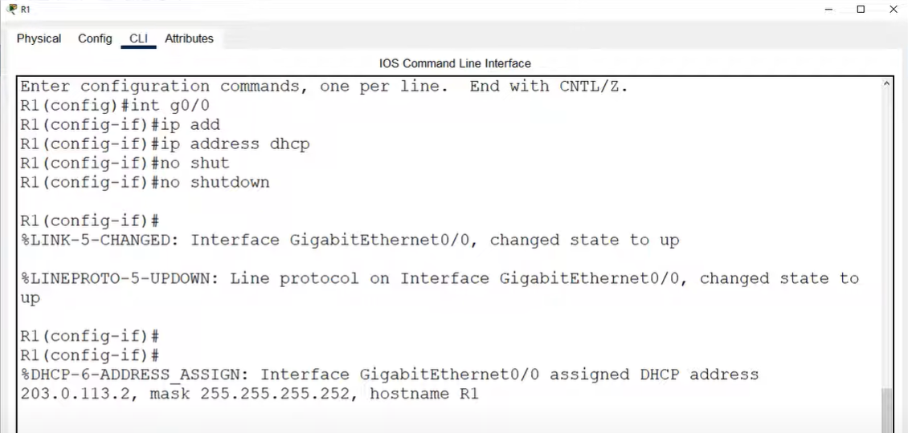
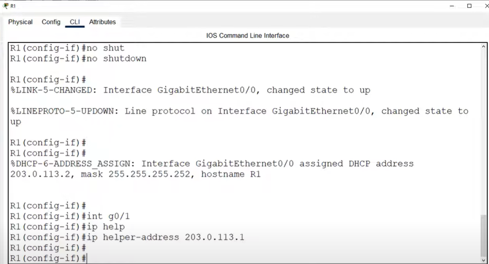
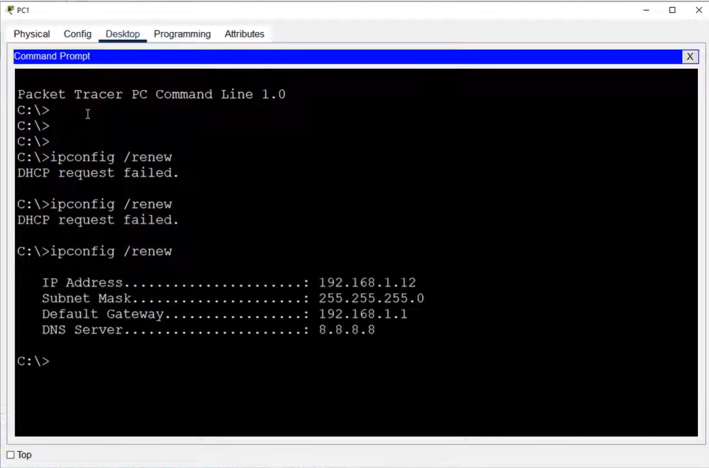

# CONTENTS

## [LAB](#lab)
### [Q1-2-3-4](#q1-2-3-4), [Commands](#commands), [Notes](#notes)

### <a name="lab"></a>LAB



### <a name="q1-2-3-4"></a>Q1-2-3-4

```
R2>en
R2#conf t
Enter configuration commands, one per line.  End with CNTL/Z.
R2(config)#ip dhcp excluded-address 192.168.1.1 192.168.1.10
R2(config)#ip dhcp excluded-address 192.168.2.1 192.168.2.10
R2(config)#ip dhcp excluded-address 203.0.113.1 
R2(config)#ip dhcp pool POOL1
R2(dhcp-config)#network 192.168.1.0 255.255.255.0
R2(dhcp-config)#dns-server 8.8.8.8
R2(dhcp-config)#default-router 192.168.1.1
R2(dhcp-config)#exit
R2(config)#ip dhcp pool POOL2
R2(dhcp-config)#network 192.168.2.0 255.255.255.0
R2(dhcp-config)#dns-server 8.8.8.8
R2(dhcp-config)#default-router 192.168.2.1
R2(dhcp-config)#exit
R2(config)#ip dhcp pool POOL3
R2(dhcp-config)#network 203.0.113.0 255.255.255.252
```

```
R2(config)#do sh run | section dhcp
ip dhcp excluded-address 192.168.1.1 192.168.1.10
ip dhcp excluded-address 192.168.2.1 192.168.2.10
ip dhcp excluded-address 203.0.113.1
ip dhcp pool POOL1
 network 192.168.1.0 255.255.255.0
 default-router 192.168.1.1
 dns-server 8.8.8.8
ip dhcp pool POOL2
 network 192.168.2.0 255.255.255.0
 default-router 192.168.2.1
 dns-server 8.8.8.8
ip dhcp pool POOL3
 network 203.0.113.0 255.255.255.252
R2(config)#
```







### <a name="commands"></a>Commands

### <a name="notes"></a>Notes