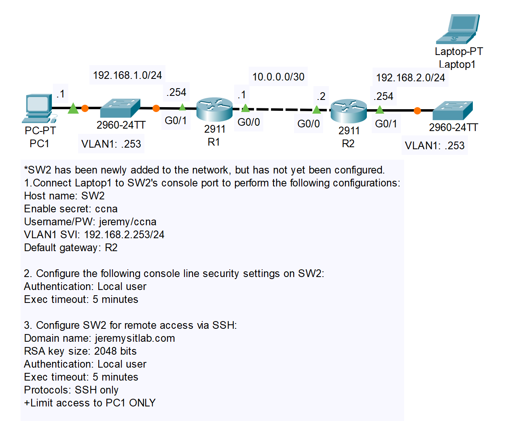
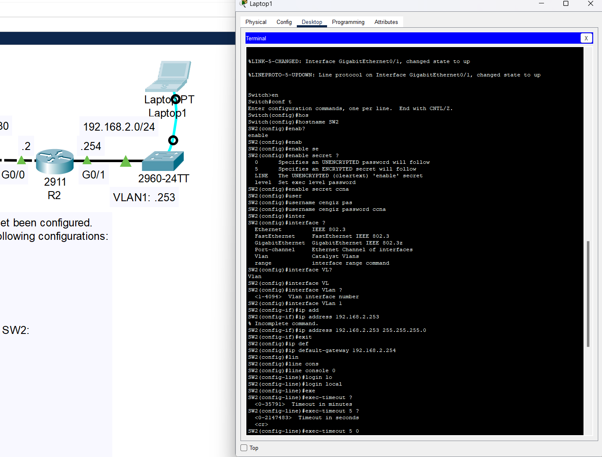
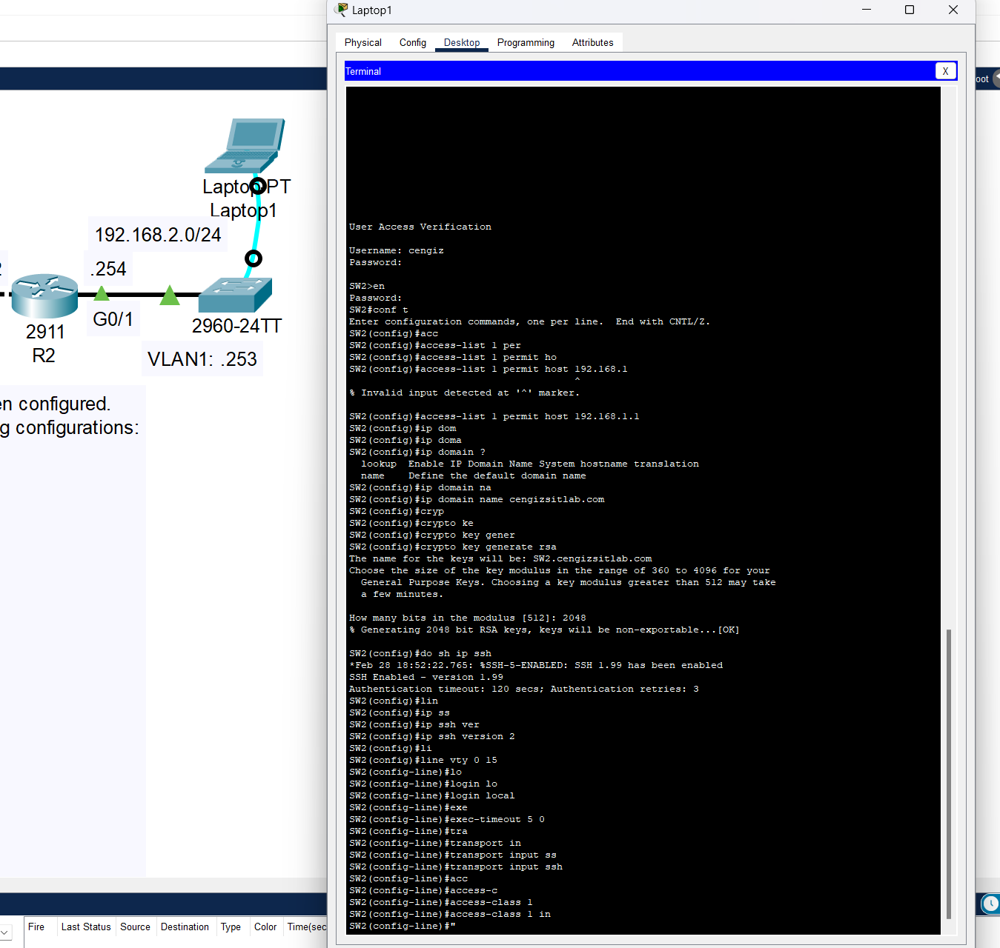
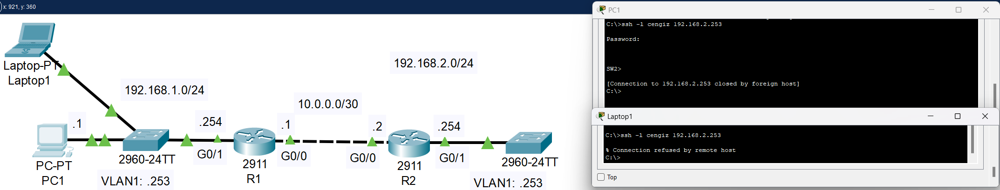

# CONTENTS

## [LAB](#lab)
### [Q1-2](#q1-2), [Q3](#q3), [Commands](#commands), [Notes](#notes)

### <a name="lab"></a>LAB



### <a name="q1-2"></a>Q1-2



### <a name="q3"></a>Q3



```
## Eklendi
.
.
.
SW2(config)#ip default-gateway 192.168.2.254
SW2(config)#interface vlan 1
SW2(config-if)#no shutdown 
.
.
.
```



### <a name="commands"></a>Commands

### <a name="notes"></a>Notes