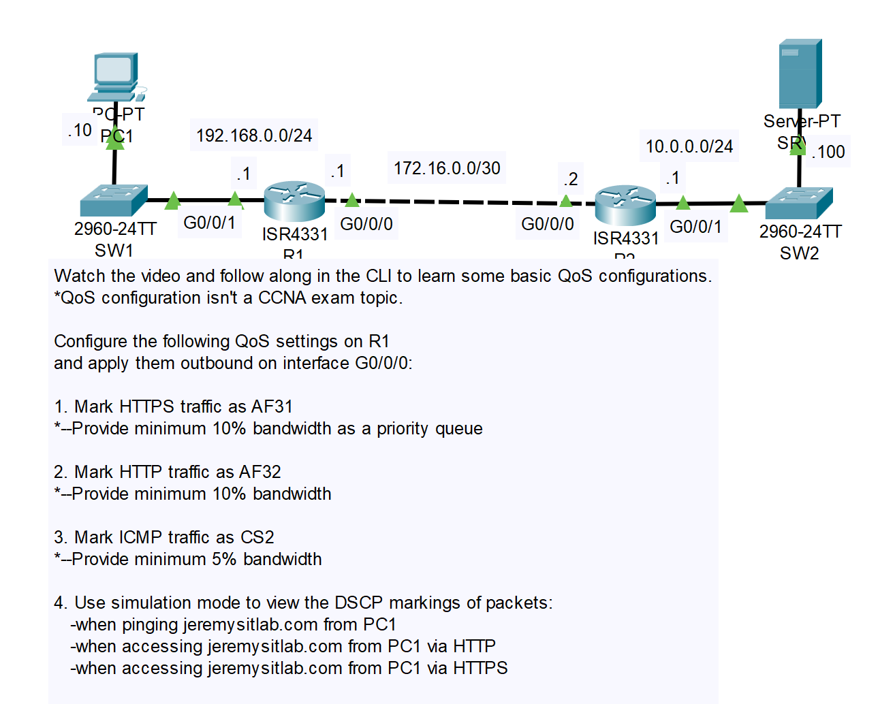
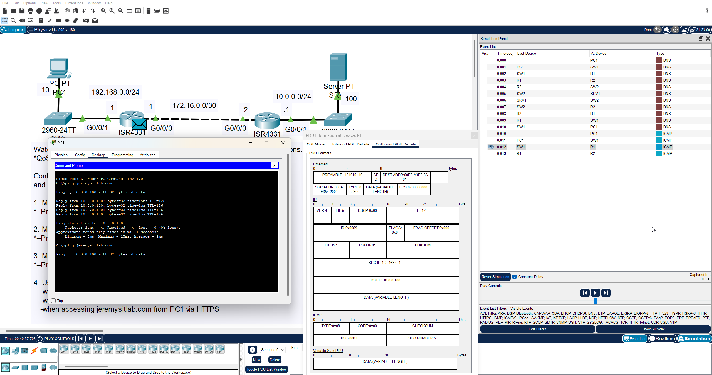
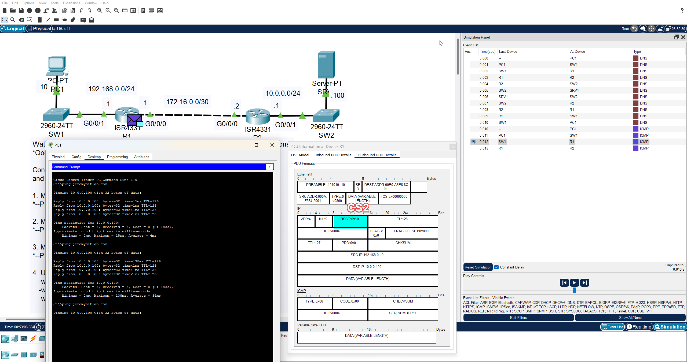

# CONTENTS

## [LAB](#lab)
### [Q0](#q0), [Q1-2-3](#q1-2-3), [Commands](#commands), [Notes](#notes)

### <a name="lab"></a>LAB



### <a name="q0"></a>Q0

- Default:(in packet tracer it shows 8 bit dscp but it is wrong - 6 bits dscp 2 bits ecn)
  
  

### <a name="q1-2-3"></a>Q1-2-3

```

R1>en
R1#conf t
Enter configuration commands, one per line.  End with CNTL/Z.
R1(config)#class-map HTTPS_MAP
R1(config-cmap)#match protocol ?
  arp     IP ARP
  bgp     Border Gateway Protocol
  cdp     Cisco Discovery Protocol
  dhcp    Dynamic Host Configuration
  dns     Domain Name Server lookup
  eigrp   Enhanced Interior Gateway Routing Protocol
  ftp     File Transfer Protocol
  gre     Generic Routing Encapsulation
  h323    H323 Protocol
  http    Hypertext Transfer Protocol
  https   Secure Hypertext Transfer Protocol
  icmp    ICMP
  ip      IP
  ipsec   IP Security Protocol (ESP/AH)
  ipv6    IPV6
  ntp     Network Time Protocol
  ospf    Open Shortest Path First
  pop3    Post Office Protocol
  rip     Routing Information Protocol
  rtp     Real Time Protocol
  skinny  Skinny Call Control Protocol
  smtp    Simple Mail Transfer Protocol

R1(config-cmap)#match protocol https
R1(config-cmap)#exit
R1(config)#class-map HTTP_MAP
R1(config-cmap)#match protocol http
R1(config-cmap)#exit
R1(config)#class-map ICMP_MAP
R1(config-cmap)#match protocol icmp 
R1(config-cmap)#exit
R1(config)#do sh run | secti class
class-map match-all HTTPS_MAP
 match protocol https
class-map match-all HTTP_MAP
 match protocol http
class-map match-all ICMP_MAP
 match protocol icmp
ip classless
R1(config)#class-map ?
  WORD       class-map name
  match-all  Logical-AND all matching statements under this classmap
  match-any  Logical-OR all matching statements under this classmap
  type       type of the class-map
R1(config)#policy-map G0/0/0_OUT
R1(config-pmap)#class HTTPS_MAP
R1(config-pmap-c)#?
  bandwidth       Bandwidth
  exit            Exit from class action configuration mode
  no              Negate or set default values of a command
  priority        Strict Scheduling Priority for this Class
  queue-limit     Queue Max Threshold for Tail Drop
  random-detect   Enable Random Early Detection as drop policy
  service-policy  Configure Flow Next
  set             Set QoS values
  shape           Traffic Shaping
R1(config-pmap-c)#set ip dscp AF31
R1(config-pmap-c)#priority percent 10
R1(config-pmap-c)#exit
R1(config-pmap)#class HTTP_MAP
R1(config-pmap-c)#set ip dscp af32
R1(config-pmap-c)#bandwidth percent 10
R1(config-pmap-c)#exit
R1(config-pmap)#class ICMP_MAP
R1(config-pmap-c)#set ip dscp cs2
R1(config-pmap-c)#bandwidth percent 5
R1(config-pmap-c)#exit
R1(config-pmap)#exit
R1(config)#do sh runn | section policy
policy-map G0/0/0_OUT
 class HTTPS_MAP
  priority percent 10
  set ip dscp af31
 class HTTP_MAP
  bandwidth percent 10
  set ip dscp af32
 class ICMP_MAP
  bandwidth percent 5
  set ip dscp cs2
R1(config)#int g0/0/0 
R1(config-if)#service-policy output G0/0/0_OUT
R1(config-if)#end
R1#
%SYS-5-CONFIG_I: Configured from console by console

R1#show running-config 
Building configuration...

Current configuration : 1102 bytes
!
version 15.4
no service timestamps log datetime msec
no service timestamps debug datetime msec
no service password-encryption
!
hostname R1
!
!
!
!
!
!
!
!
ip cef
no ipv6 cef
!
!
!
!
!
!
!
!
!
!
!
!
spanning-tree mode pvst
!
class-map match-all HTTPS_MAP
 match protocol https
class-map match-all HTTP_MAP
 match protocol http
class-map match-all ICMP_MAP
 match protocol icmp
!
policy-map G0/0/0_OUT
 class HTTPS_MAP
  priority percent 10
  set ip dscp af31
 class HTTP_MAP
  bandwidth percent 10
  set ip dscp af32
 class ICMP_MAP
  bandwidth percent 5
  set ip dscp cs2
!
!
!
!
!
interface GigabitEthernet0/0/0
 ip address 172.16.0.1 255.255.255.252
 service-policy output G0/0/0_OUT
 duplex auto
 speed auto
!
interface GigabitEthernet0/0/1
 ip address 192.168.0.1 255.255.255.0
 duplex auto
 speed auto
!
interface GigabitEthernet0/0/2
 media-type sfp
 no ip address
 duplex auto
 speed auto
 shutdown
!
interface Vlan1
 no ip address
 shutdown
!
ip classless
ip route 0.0.0.0 0.0.0.0 172.16.0.2 
!
ip flow-export version 9
!
!
!
!
!
!
!
line con 0
!
line aux 0
!
line vty 0 4
 login
!
!
!
end


```

### <a name="q4"></a>Q4
For Ping:
  
  

### <a name="commands"></a>Commands

### <a name="notes"></a>Notes