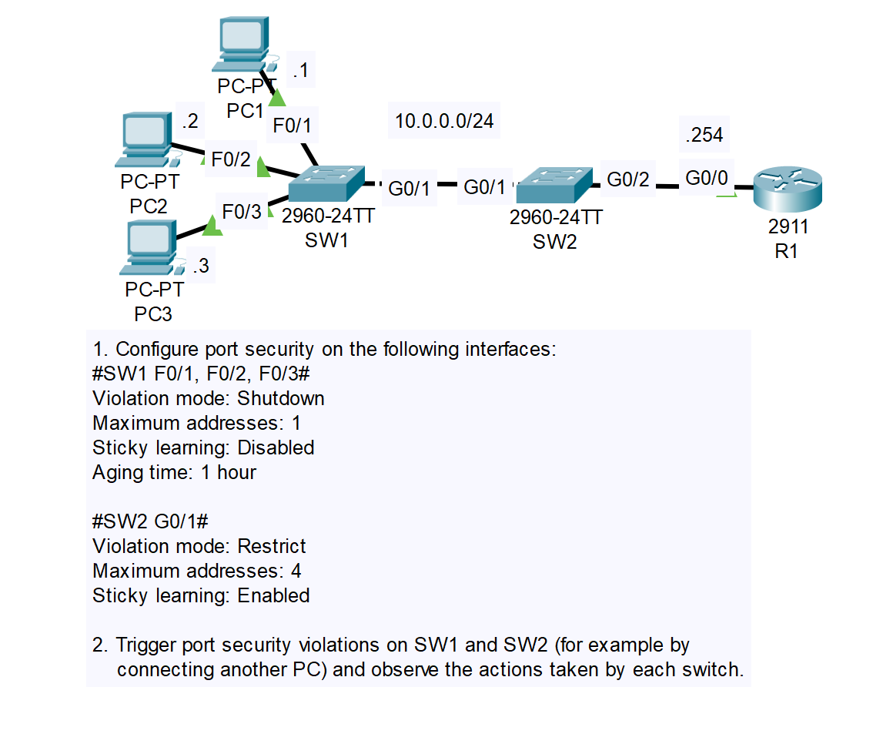
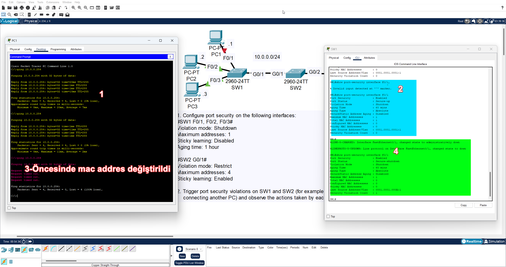

# CONTENTS

## [LAB](#lab)
### [Q1](#q1), [Q2](#q2), [Commands](#commands), [Notes](#notes)

### <a name="lab"></a>LAB



### <a name="q1"></a>Q1

```
SW1>
SW1>en
SW1#conf t
Enter configuration commands, one per line.  End with CNTL/Z.
SW1(config)#inter
SW1(config)#interface f0/1-3
                         ^
% Invalid input detected at '^' marker.
	
SW1(config)#interface range f0/1-3
SW1(config-if-range)#sw
SW1(config-if-range)#switchport mo
SW1(config-if-range)#switchport mode acc
SW1(config-if-range)#switchport mode access 
SW1(config-if-range)#sw
SW1(config-if-range)#switchport mo
SW1(config-if-range)#switchport mode sec
SW1(config-if-range)#switchport mode ?
  access   Set trunking mode to ACCESS unconditionally
  dynamic  Set trunking mode to dynamically negotiate access or trunk mode
  trunk    Set trunking mode to TRUNK unconditionally
SW1(config-if-range)#switchport po
SW1(config-if-range)#switchport port-security 
SW1(config-if-range)#sw
SW1(config-if-range)#switchport por
SW1(config-if-range)#switchport port-security vi
SW1(config-if-range)#switchport port-security violation ?
  protect   Security violation protect mode
  restrict  Security violation restrict mode
  shutdown  Security violation shutdown mode
SW1(config-if-range)#switchport port-security violation sh
SW1(config-if-range)#switchport port-security violation shutdown 
SW1(config-if-range)#sw
SW1(config-if-range)#switchport po
SW1(config-if-range)#switchport port-security ?
  aging        Port-security aging commands
  mac-address  Secure mac address
  maximum      Max secure addresses
  violation    Security violation mode
  <cr>
SW1(config-if-range)#switchport port-security max
SW1(config-if-range)#switchport port-security maximum ?
  <1-132>  Maximum addresses
SW1(config-if-range)#switchport port-security maximum 1
SW1(config-if-range)#sw
SW1(config-if-range)#switchport por
SW1(config-if-range)#switchport port-security ag
SW1(config-if-range)#switchport port-security aging ?
  time  Port-security aging time
SW1(config-if-range)#switchport port-security aging t
SW1(config-if-range)#switchport port-security aging time ?
  <1-1440>  Aging time in minutes. Enter a value between 1 and 1440
SW1(config-if-range)#switchport port-security aging time 60
SW1(config-if-range)#exit
SW1(config)#exit
SW1#
%SYS-5-CONFIG_I: Configured from console by console
sho
SW1#show por
SW1#show port-security ?
  address    Show secure address
  interface  Show secure interface
  <cr>
SW1#show port-security 
Secure Port MaxSecureAddr CurrentAddr SecurityViolation Security Action
               (Count)       (Count)        (Count)
--------------------------------------------------------------------
        Fa0/1        1          0                 0         Shutdown
        Fa0/2        1          0                 0         Shutdown
        Fa0/3        1          0                 0         Shutdown
----------------------------------------------------------------------
SW1#show port-security ?
  address    Show secure address
  interface  Show secure interface
  <cr>
SW1#show port-security inter
SW1#show port-security interface f0/1
Port Security              : Enabled
Port Status                : Secure-up
Violation Mode             : Shutdown
Aging Time                 : 60 mins
Aging Type                 : Absolute
SecureStatic Address Aging : Disabled
Maximum MAC Addresses      : 1
Total MAC Addresses        : 0
Configured MAC Addresses   : 0
Sticky MAC Addresses       : 0
Last Source Address:Vlan   : 0000.0000.0000:0
Security Violation Count   : 0
```


### <a name="q2"></a>Q2

```
SW2>
SW2>en
SW2#conf
SW2#configure t
SW2#configure terminal 
Enter configuration commands, one per line.  End with CNTL/Z.
SW2(config)#por
SW2(config)#sw
SW2(config)#inter
SW2(config)#interface g0/2
SW2(config-if)#sw
SW2(config-if)#switchport mo
SW2(config-if)#switchport mode tr
SW2(config-if)#switchport mode trunk 

SW2(config-if)#
%LINEPROTO-5-UPDOWN: Line protocol on Interface GigabitEthernet0/2, changed state to down

%LINEPROTO-5-UPDOWN: Line protocol on Interface GigabitEthernet0/2, changed state to up

SW2(config-if)#sw
SW2(config-if)#switchport por
SW2(config-if)#switchport port-security 
SW2(config-if)#sw
SW2(config-if)#switchport por
SW2(config-if)#switchport port-security ?
  aging        Port-security aging commands
  mac-address  Secure mac address
  maximum      Max secure addresses
  violation    Security violation mode
  <cr>
SW2(config-if)#switchport port-security ma
SW2(config-if)#switchport port-security max
SW2(config-if)#switchport port-security ?
  aging        Port-security aging commands
  mac-address  Secure mac address
  maximum      Max secure addresses
  violation    Security violation mode
  <cr>
SW2(config-if)#switchport port-security max
SW2(config-if)#switchport port-security maximum 4
SW2(config-if)#switchport port-security vi
SW2(config-if)#switchport port-security violation ?
  protect   Security violation protect mode
  restrict  Security violation restrict mode
  shutdown  Security violation shutdown mode
SW2(config-if)#switchport port-security violation res
SW2(config-if)#switchport port-security violation restrict 
SW2(config-if)#sw
SW2(config-if)#switchport port
SW2(config-if)#switchport port-security ?
  aging        Port-security aging commands
  mac-address  Secure mac address
  maximum      Max secure addresses
  violation    Security violation mode
  <cr>
SW2(config-if)#switchport port-security ma
SW2(config-if)#switchport port-security mac
SW2(config-if)#switchport port-security mac-address st
SW2(config-if)#switchport port-security mac-address sticky 
SW2(config-if)#do sh port-se
SW2(config-if)#do sh port-se
Secure Port MaxSecureAddr CurrentAddr SecurityViolation Security Action
               (Count)       (Count)        (Count)
--------------------------------------------------------------------
       Gig0/2        4          0                 0         Restrict
----------------------------------------------------------------------
SW2(config-if)#do sh port-se int g0/2
Port Security              : Enabled
Port Status                : Secure-up
Violation Mode             : Restrict
Aging Time                 : 0 mins
Aging Type                 : Absolute
SecureStatic Address Aging : Disabled
Maximum MAC Addresses      : 4
Total MAC Addresses        : 0
Configured MAC Addresses   : 0
Sticky MAC Addresses       : 0
Last Source Address:Vlan   : 0000.0000.0000:0
Security Violation Count   : 0
```

### <a name="q1"></a>Q1




### <a name="commands"></a>Commands

### <a name="notes"></a>Notes