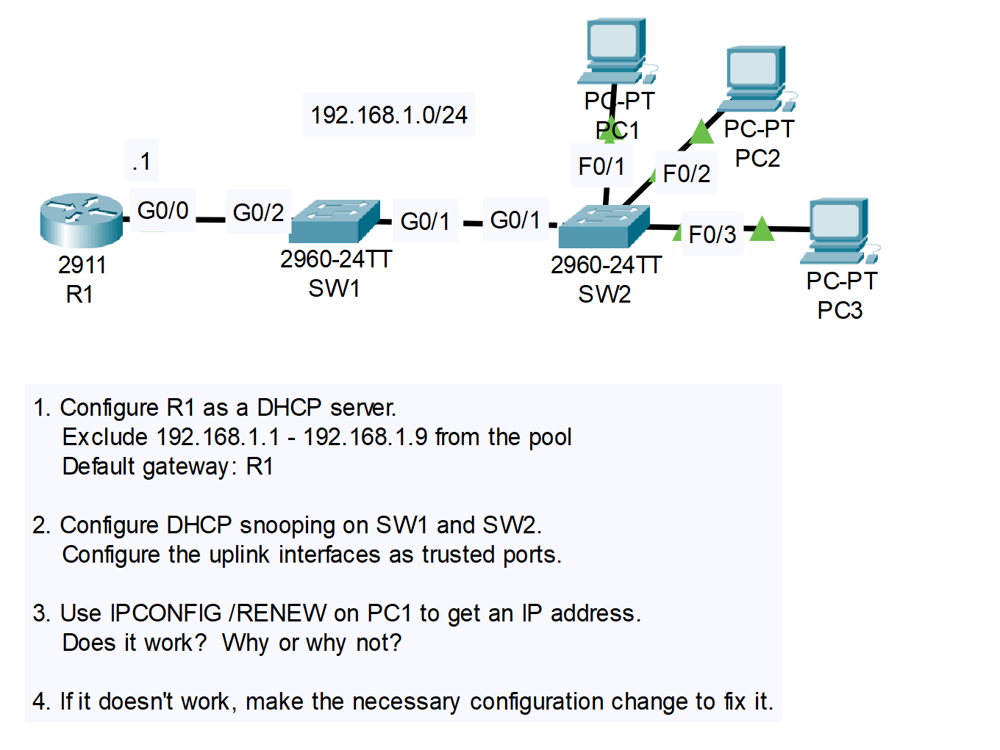
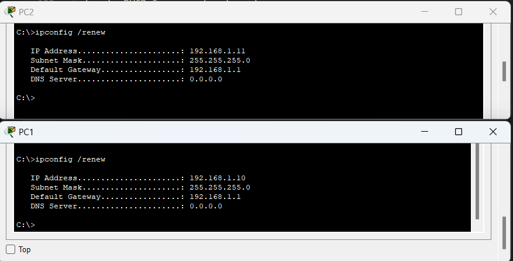

# CONTENTS

## [LAB](#lab)
### [Q1](#q1), [Q2](#q2), [Q3](#q3), [Commands](#commands), [Notes](#notes)

### <a name="lab"></a>LAB



### <a name="q1"></a>Q1

```
R1>en
R1#conf t
Enter configuration commands, one per line.  End with CNTL/Z.
R1(config)#ip excl
R1(config)#ip dh
R1(config)#ip dhcp exc
R1(config)#ip dhcp excluded-address ?
  A.B.C.D  Low IP address
R1(config)#ip dhcp excluded-address 192.168.1.1 192.168.1.9
R1(config)#ip dh
R1(config)#ip dhcp ?
  excluded-address  Prevent DHCP from assigning certain addresses
  pool              Configure DHCP address pools
  relay             DHCP relay agent parameters
R1(config)#ip dhcp po
R1(config)#ip dhcp pool POOL_1
R1(dhcp-config)#NETW
R1(dhcp-config)#NETWork ?
  A.B.C.D  Network number in dotted-decimal notation
R1(dhcp-config)#NETWork 192.168.1.0 ?
  A.B.C.D  Network mask
R1(dhcp-config)#NETWork 192.168.1.0 255.255.255.0
R1(dhcp-config)#DEF
R1(dhcp-config)#DEFault-router 192.168.1.1
R1(dhcp-config)#exit
R1(config)#
```

### <a name="q2"></a>Q2

```
SW2>en
SW2#conf t
Enter configuration commands, one per line.  End with CNTL/Z.
SW2(config)#ip
SW2(config)#ip dh
SW2(config)#ip dhcp ?
  excluded-address  Prevent DHCP from assigning certain addresses
  pool              Configure DHCP address pools
  relay             DHCP relay agent parameters
  snooping          DHCP Snooping
  use               Configure use of certain parameters during allocation
SW2(config)#ip dhcp sn
SW2(config)#ip dhcp snooping ?
  database     DHCP Snooping database agent
  information  DHCP Snooping information
  verify       DHCP Snooping verify
  vlan         DHCP Snooping vlan
  <cr>
SW2(config)#ip dhcp snooping 
SW2(config)#ip dhcp snooping  ?
  database     DHCP Snooping database agent
  information  DHCP Snooping information
  verify       DHCP Snooping verify
  vlan         DHCP Snooping vlan
  <cr>
SW2(config)#ip dhcp snooping vl
SW2(config)#ip dhcp snooping vlan 1
SW2(config)#no ip ?
  access-list      Named access-list
  arp              IP ARP global configuration
  default-gateway  Specify default gateway (if not routing IP)
  dhcp             Configure DHCP server and relay parameters
  domain           IP DNS Resolver
  domain-lookup    Enable IP Domain Name System hostname translation
  domain-name      Define the default domain name
  ftp              FTP configuration commands
  hosts            Add an entry to the ip hostname table
  name-server      Specify address of name server to use
  scp              Scp commands
  ssh              Configure ssh options
SW2(config)#no ip dhc
SW2(config)#no ip dhcp ?
  excluded-address  Prevent DHCP from assigning certain addresses
  pool              Configure DHCP address pools
  relay             DHCP relay agent parameters
  snooping          DHCP Snooping
  use               Configure use of certain parameters during allocation
SW2(config)#no ip dhcp sno
SW2(config)#no ip dhcp snooping ?
  database     DHCP Snooping database agent
  information  DHCP Snooping information
  verify       DHCP Snooping verify
  vlan         DHCP Snooping vlan
  <cr>
SW2(config)#no ip dhcp snooping inf
SW2(config)#no ip dhcp snooping information op
SW2(config)#no ip dhcp snooping information option 
SW2(config)#inter
SW2(config)#interface g0/1
SW2(config-if)#ip dhc
SW2(config-if)#ip dhcp ?
  snooping  DHCP Snooping
SW2(config-if)#ip dhcp s
SW2(config-if)#ip dhcp snooping ?
  limit  DHCP Snooping limit
  trust  DHCP Snooping trust config
SW2(config-if)#ip dhcp snooping tr
SW2(config-if)#ip dhcp snooping trust 
SW2(config-if)#
```

### <a name="q3"></a>Q3




### <a name="commands"></a>Commands

### <a name="notes"></a>Notes