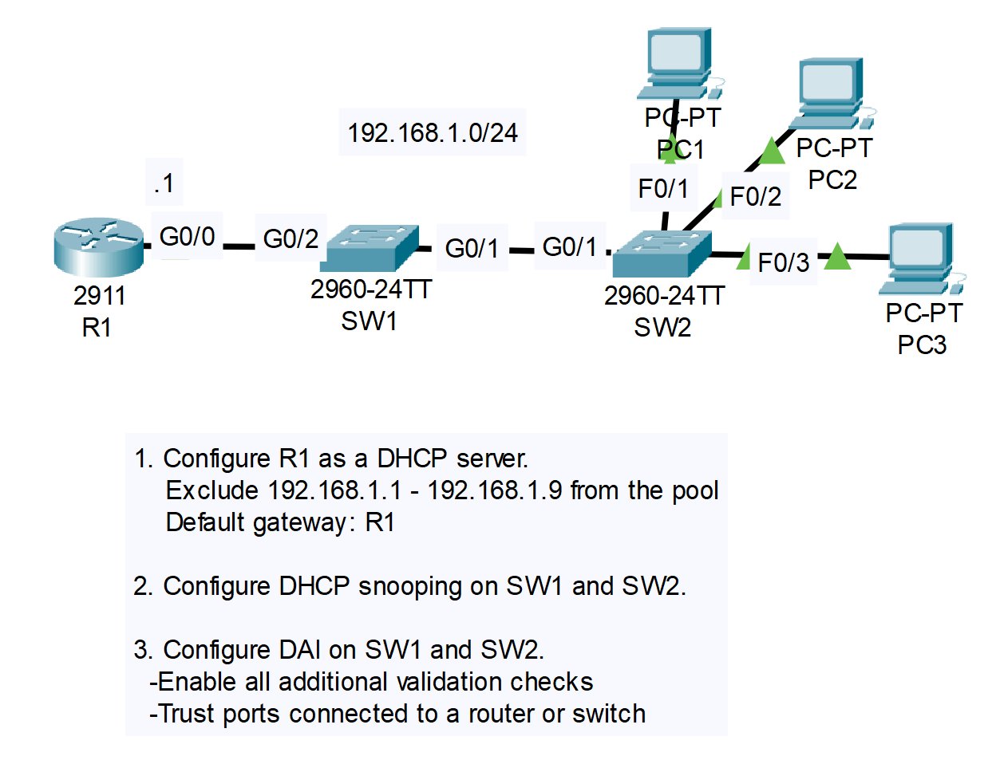
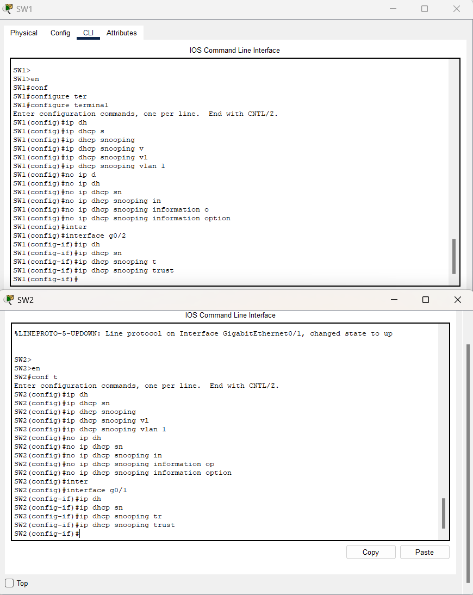
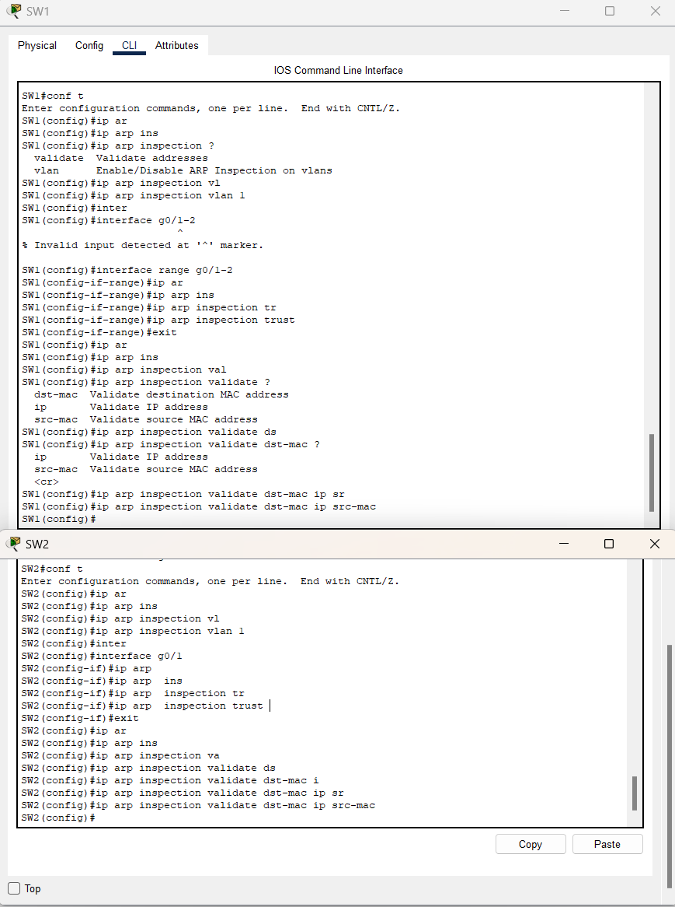

# CONTENTS

## [LAB](#lab)
### [Q1](#q1), [Q2](#q2), [Q3](#q3), [Commands](#commands), [Notes](#notes)

### <a name="lab"></a>LAB



### <a name="q1"></a>Q1

```
R1>en
R1#conf
R1#configure ter
R1#configure terminal 
Enter configuration commands, one per line.  End with CNTL/Z.
R1(config)#ip dh
R1(config)#ip dhcp ?
  excluded-address  Prevent DHCP from assigning certain addresses
  pool              Configure DHCP address pools
  relay             DHCP relay agent parameters
R1(config)#ip dhcp ex
R1(config)#ip dhcp excluded-address 192.168.1.1 192.168.1.9
R1(config)#ip dh
R1(config)#ip dhcp po
R1(config)#ip dhcp pool POOL1
R1(dhcp-config)#NET
R1(dhcp-config)#NETwork 192.168.1.0 255.255.255.0
R1(dhcp-config)#def
R1(dhcp-config)#default-router 192.168.1.1
R1(dhcp-config)#
```

### <a name="q2"></a>Q2



### <a name="q3"></a>Q3



### <a name="commands"></a>Commands

```
### If dhcp active on all of PC's

SW2#show ip dhcp snooping binding 
MacAddress          IpAddress        Lease(sec)  Type           VLAN  Interface
------------------  ---------------  ----------  -------------  ----  -----------------
00:01:64:32:B9:22   192.168.1.10     86400       dhcp-snooping  1     FastEthernet0/1
00:60:70:DB:6A:23   192.168.1.11     86400       dhcp-snooping  1     FastEthernet0/2
00:0A:41:A6:B6:0E   192.168.1.12     86400       dhcp-snooping  1     FastEthernet0/3
Total number of bindings: 3
```

### <a name="notes"></a>Notes